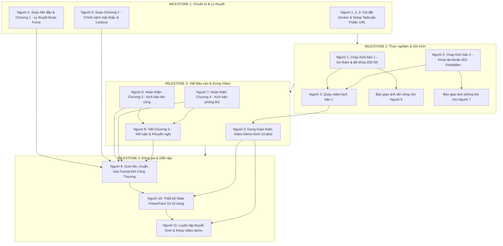

# TÀI LIỆU QUẢN LÝ DỰ ÁN: TẤN CÔNG BRUTE FORCE VÀ CHÍNH SÁCH MẬT KHẨU

## 1. Bối cảnh và Yêu cầu dự án

> 📖 **Tài liệu Kỹ thuật Chi tiết:** Xem hướng dẫn phân tích lỗ hổng do thám, kịch bản tấn công Brute Force và mã nguồn phòng thủ tại: [HUONG_DAN_DU_AN_BRUTE_FORCE.md](docs/HUONG_DAN_DU_AN_BRUTE_FORCE.md)  
> 🐳 **Hướng dẫn Cài đặt & Khởi chạy:** Xem hướng dẫn cài đặt Docker (Windows/Linux), lấy Tailscale Auth Key và chạy script tại: [HUONG_DAN_CAI_DAT_DOCKER_TAILSCALE.md](docs/HUONG_DAN_CAI_DAT_DOCKER_TAILSCALE.md)

- **Tên đề tài:** Kỹ thuật tấn công mạng - Tấn công Brute Force và chính sách mật khẩu.
- **Quy mô:** Nhóm 11 thành viên.
- **Yêu cầu đầu ra (Deliverables):**
  1. **File báo cáo Word:** Phải tuân thủ chuẩn 5 chương (Lý thuyết -> Triển khai -> Phân tích kết quả -> Kết luận). Trang bìa, mục lục, định dạng lề, font chữ phải tuân thủ nghiêm ngặt theo file mẫu của Trường Đại học Công Thương TP. HCM
  2. **Video Demo:** Quay màn hình mô phỏng kịch bản tấn công và phòng thủ, **không có quá 10 phút**.

---

## 2. Phân công nhiệm vụ chi tiết (11 Thành Viên)

### 2.1. Nhóm Kỹ thuật & Video (3 người)

- **Người 1 (Tấn công):** Chạy tool Brute Force (vd: Burp Suite/Hydra). Chụp ảnh các bước cấu hình và kết quả.
- **Người 2 (Phòng thủ):** Đăng nhập hệ thống mục tiêu, thiết lập chính sách (độ dài mật khẩu, khóa tài khoản). Chụp ảnh lúc hệ thống báo lỗi/chặn tool.
- **Người 3 (Video Editor):** Quay màn hình thao tác của Người 1 & 2. Ghép và tua nhanh thành video dưới 10 phút.

### 2.2. Nhóm Biên soạn Nội dung (5 người)

- **Người 4:** Phụ trách **Mở đầu & Chương 1**.
- **Người 5:** Phụ trách **Chương 2**.
- **Người 6:** Phụ trách **Chương 3**.
- **Người 7:** Phụ trách **Chương 4**.
- **Người 8:** Phụ trách **Chương 5**.
- _(Xem dàn ý chi tiết từng chương ở Mục 6 bên dưới)_

### 2.3. Nhóm QA/QC & Trình bày (3 người)

- **Người 9 (Tổng biên tập / Định dạng Word):** Gom file từ 5 người viết. Xóa format rác, đồng bộ font, canh lề, tạo mục lục tự động giống hệt form mẫu.
- **Người 10 (Thiết kế Slide):** Lọc ý chính từ file Word để làm PowerPoint.
- **Người 11 (Diễn giả):** Thuyết trình trước lớp, khớp kịch bản nói với tiến độ của Video Demo.

---

## 3. TIMELINE & MILESTONES THỰC HIỆN DỰ ÁN (11 THÀNH VIÊN)

Dự án được triển khai qua **4 Cột mốc (Milestones)** với sự phối hợp chuyển giao liên tục giữa 11 thành viên theo quy trình khép kín:

### 3.1. Bảng Trách Nhiệm & Thứ Tự Thực Hiện Từng Người (11 Thành Viên)

| Thứ tự | Thành viên | Vai trò chính | Điều kiện bắt đầu (Phụ thuộc) | Sản phẩm đầu ra (Deliverable) | Hạn chót (Milestone) |
| :---: | :--- | :--- | :--- | :--- | :--- |
| **1** | **Người 1** | Kỹ thuật Tấn công | Docker & Tailscale đã online | Bộ ảnh chụp 4 bước tấn công (lộ admin, swagger, brute force 200 OK) tại `assets/images/` | **Milestone 2** |
| **2** | **Người 2** | Kỹ thuật Phòng thủ | Sau khi Người 1 tấn công xong Kịch bản 1 | Code Account Lockout & ảnh chụp hệ thống báo lỗi HTTP 403/429 tại `assets/images/` | **Milestone 2** |
| **3** | **Người 3** | Video Editor | Đi cùng thao tác của Người 1 & Người 2 | Video Demo hoàn chỉnh $\le 10$ phút (mp4/link Drive) tại `assets/video/` | **Milestone 3** |
| **4** | **Người 4** | Viết Mở đầu & Chương 1 | Bắt đầu ngay từ ngày đầu | File Word nháp `Chuong1.docx` tại `docs/drafts/` | **Milestone 1** |
| **5** | **Người 5** | Viết Chương 2 | Bắt đầu ngay từ ngày đầu | File Word nháp `Chuong2.docx` tại `docs/drafts/` | **Milestone 1** |
| **6** | **Người 6** | Viết Chương 3 | Nhận bộ ảnh thực nghiệm từ Người 1 | File Word nháp `Chuong3.docx` gắn đầy đủ ảnh tấn công tại `docs/drafts/` | **Milestone 3** |
| **7** | **Người 7** | Viết Chương 4 | Nhận bộ ảnh thực nghiệm từ Người 2 | File Word nháp `Chuong4.docx` gắn đầy đủ ảnh phòng thủ tại `docs/drafts/` | **Milestone 3** |
| **8** | **Người 8** | Viết Chương 5 | Nhận kết quả phân tích từ Người 6 & 7 | File Word nháp `Chuong5.docx` tại `docs/drafts/` | **Milestone 3** |
| **9** | **Người 9** | Tổng biên tập / Format Word | Nhận đủ 5 file Word từ Người 4, 5, 6, 7, 8 | Bản Báo cáo Word hoàn chỉnh chuẩn mẫu ĐH Công Thương TP.HCM tại `FINAL_DELIVERY/` | **Milestone 4** |
| **10** | **Người 10** | Thiết kế Slide | Nhận bản Word hoàn chỉnh từ Người 9 & Video từ Người 3 | Bộ Slide thuyết trình `.pptx` (10 - 15 trang) tại `presentations/` | **Milestone 4** |
| **11** | **Người 11** | Thuyết trình & Diễn giả | Nhận Slide từ Người 10 & Video từ Người 3 | Kịch bản nói (Speech script) khớp từng giây với Video demo dưới 10 phút | **Milestone 4** |

---

### 3.2. Chi Tiết 4 Cột Mốc Quan Trọng (Milestones)

#### 🚩 Milestone 1: Khởi Động, Môi Trường & Cơ Sở Lý Thuyết (Ngày 1 - Ngày 3)
- **Nhiệm vụ:**
  - Nhóm kỹ thuật (Người 1, 2, 3) triển khai Docker và cấp phát Public URL thành công (xem [HUONG_DAN_CAI_DAT_DOCKER_TAILSCALE.md](docs/HUONG_DAN_CAI_DAT_DOCKER_TAILSCALE.md)).
  - Người 4 hoàn thành bản nháp Mở đầu và Chương 1 (Lý thuyết xác thực, Brute Force vs Dictionary Attack, công cụ Burp Suite/Hydra).
  - Người 5 hoàn thành bản nháp Chương 2 (Chính sách mật khẩu NIST, cơ chế Account Lockout, Rate Limiting).
- **Tiêu chí nghiệm thu (Checklist M1):**
  - [ ] Web Frontend (`chat...`) và Backend Swagger UI (`chat-ts.../docs`) truy cập được qua Internet bằng domain Tailscale Funnel.
  - [ ] Có `docs/drafts/Chuong1.docx` và `docs/drafts/Chuong2.docx`.

#### 🚩 Milestone 2: Thực Nghiệm Tấn Công & Phòng Thủ (Ngày 4 - Ngày 7)
- **Nhiệm vụ:**
  - Người 1 thực hiện Kịch bản 1: Do thám API Guestbook $\rightarrow$ Tra cứu CT Logs tại certkit.io tìm subdomain backend `chat-ts` $\rightarrow$ Khám phá Swagger `/docs` $\rightarrow$ Chạy từ điển trên Burp Suite Intruder $\rightarrow$ Bắt mã HTTP 200 OK tại mật khẩu `admin123`.
  - Người 2 thực hiện Kịch bản 2: Vá code Account Lockout $\rightarrow$ Chạy lại công cụ $\rightarrow$ Bị chặn đứng với mã HTTP 403 Forbidden sau 5 lần sai.
  - Người 3 quay toàn bộ màn hình thao tác của Người 1 và Người 2, lưu trữ video thô (raw footage).
- **Tiêu chí nghiệm thu (Checklist M2):**
  - [ ] Thư mục `assets/images/` có đầy đủ ảnh chụp minh chứng mã HTTP 200 và HTTP 403.
  - [ ] Người 3 có toàn bộ video quay các thao tác thực nghiệm.

#### 🚩 Milestone 3: Biên Soạn Báo Cáo 5 Chương & Hậu Kỳ Video (Ngày 8 - Ngày 11)
- **Nhiệm vụ:**
  - Người 6 dùng ảnh của Người 1 viết xong Chương 3.
  - Người 7 dùng ảnh của Người 2 viết xong Chương 4.
  - Người 8 tổng hợp kết quả viết xong Chương 5 (Kết luận, hạn chế và hướng phát triển).
  - Người 3 dựng video demo hoàn chỉnh: Cắt ghép, tua nhanh đoạn lặp, chèn phụ đề/thuyết minh, đảm bảo thời lượng **dưới 10 phút**.
- **Tiêu chí nghiệm thu (Checklist M3):**
  - [ ] Đầy đủ 5 file `Chuong1.docx` đến `Chuong5.docx` trong `docs/drafts/`.
  - [ ] Video demo hoàn thiện nằm tại `assets/video/` (hoặc có link Google Drive trong `assets/video/link_drive.txt`).

#### 🚩 Milestone 4: Đóng Gói Toàn Diện, Thiết Kế Slide & Diễn Tập (Ngày 12 - Ngày 14)
- **Nhiệm vụ:**
  - Người 9 thu nhận 5 file Word, ghép thành 1 file duy nhất, chuẩn hóa format (Font Times New Roman 13/14, lề trên 2cm, dưới 2cm, trái 3cm, phải 2cm, dãn dòng 1.5, mục lục tự động).
  - Người 10 thiết kế Slide PowerPoint (10 - 15 slide) bám sát các đề mục báo cáo và hình ảnh trực quan.
  - Người 11 soạn kịch bản nói, luyện tập thuyết trình khớp tiến độ video demo dưới 10 phút trước cả nhóm để nhận góp ý.
- **Tiêu chí nghiệm thu (Checklist M4 - Final Delivery):**
  - [ ] File báo cáo Word hoàn chỉnh tại `FINAL_DELIVERY/BaoCao_Nhom1_BruteForce.docx`.
  - [ ] File Slide trình chiếu tại `presentations/Slide_Nhom1_BruteForce.pptx`.
  - [ ] Video demo sẵn sàng phát trong buổi thuyết trình.
  - [ ] Diễn giả (Người 11) tự tin thuyết trình trôi chảy dưới 10 phút.

---

## 4. Quy định làm việc & Quản lý Git

- `docs/drafts/`: Chứa file Word nháp của Người 4, 5, 6, 7, 8 (vd: `Chuong1_NguyenVanA.docx`).
- `assets/images/`: Chứa ảnh chụp màn hình demo của Người 1, 2.
- `assets/video/`: Chứa file video của Người 3 (Nếu > 100MB, tạo file `link_drive.txt`).
- `presentations/`: Chứa file Slide `.pptx`.
- `FINAL_DELIVERY/`: Nơi Người 9 push bản Word báo cáo cuối cùng hoàn chỉnh.

---

## 5. DÀN Ý CHI TIẾT TỪNG CHƯƠNG (BẮT BUỘC TUÂN THỦ)

Các thành viên phụ trách viết báo cáo (Người 4, 5, 6, 7, 8) phải dùng đúng các Tiêu đề (Heading) dưới đây trong file Word của mình. Có thể bổ sung ý nếu thấy phù hợp.

### PHẦN MỞ ĐẦU (Người 4 viết)

- **1. Lý do chọn đề tài:** Tầm quan trọng của mật khẩu trong bảo mật hệ thống thông tin, sự nguy hiểm của tấn công dò mật khẩu.
- **2. Mục tiêu nghiên cứu:** Tìm hiểu nguyên lý Brute Force và cách chống lại bằng cấu hình hệ thống.
- **3. Đối tượng và phạm vi nghiên cứu:** (Ghi rõ: Chỉ tập trung demo trên form đăng nhập web giả định hoặc giao thức cụ thể, không tấn công hệ thống thực tế bên ngoài).

### CHƯƠNG 1: CƠ SỞ LÝ THUYẾT VỀ BRUTE FORCE (Người 4 viết)

- **1.1. Khái niệm xác thực người dùng:** Giải thích ngắn gọn cơ chế Username/Password hoạt động ra sao.
- **1.2. Kỹ thuật tấn công Brute Force là gì?** Định nghĩa, ưu điểm (chắc chắn tìm ra nếu đủ thời gian) và nhược điểm (tốn tài nguyên, dễ bị phát hiện).
- **1.3. Kỹ thuật Dictionary Attack (Tấn công từ điển):** Phân biệt sự khác nhau giữa Brute Force thuần túy (thử mọi tổ hợp) và dùng Wordlist.
- **1.4. Các công cụ phổ biến:** Giới thiệu ngắn 1-2 công cụ (vd: Burp Suite Intruder, Hydra) mà nhóm dự định dùng.

### CHƯƠNG 2: CHÍNH SÁCH MẬT KHẨU VÀ PHÒNG THỦ (Người 5 viết)

- **2.1. Chính sách mật khẩu (Password Policy) là gì?** Định nghĩa và vai trò trong việc bảo vệ hệ thống.
- **2.2. Tiêu chuẩn của một mật khẩu mạnh:** Phân tích yếu tố độ dài (min length) và độ phức tạp (chữ hoa, chữ thường, số, ký tự đặc biệt).
- **2.3. Cơ chế Account Lockout (Khóa tài khoản):** Giải thích cách hệ thống đếm số lần đăng nhập sai và thời gian khóa (Lockout duration) để bẻ gãy Brute Force.
- **2.4. Các cơ chế bổ sung (Tùy chọn):** Giới thiệu thêm về Rate Limiting (Giới hạn tốc độ request) hoặc CAPTCHA.

### CHƯƠNG 3: TRIỂN KHAI KỊCH BẢN TẤN CÔNG (Người 6 viết)

_(Lưu ý: Chương này phải chèn hình ảnh do Người 1 cung cấp)_

- **3.1. Thiết lập môi trường tấn công:** Mô tả hệ thống "nạn nhân" (IP, chức năng form đăng nhập) và công cụ tấn công được sử dụng.
- **3.2. Chuẩn bị Wordlist:** Liệt kê một số mật khẩu mẫu có trong file từ điển.
- **3.3. Các bước tiến hành tấn công:** Trình bày theo dạng Bước 1, Bước 2... (Cấu hình IP -> Nạp wordlist -> Bắt đầu chạy).
- **3.4. Kết quả kịch bản 1:** Chụp ảnh màn hình cho thấy công cụ đã bắt được HTTP Status Code (vd: 200 OK hoặc 302 Found) và tìm ra mật khẩu thành công.

### CHƯƠNG 4: TRIỂN KHAI PHÒNG THỦ VÀ PHÂN TÍCH (Người 7 viết)

_(Lưu ý: Chương này phải chèn hình ảnh do Người 2 cung cấp)_

- **4.1. Thiết lập chính sách bảo vệ trên hệ thống:** Trình bày các bước Admin cấu hình (Ví dụ: Chỉnh policy khóa tài khoản sau 5 lần nhập sai).
- **4.2. Kịch bản tấn công lại:** Chạy lại tool Brute Force ở Chương 3 vào hệ thống vừa được bảo vệ.
- **4.3. Phân tích kết quả:**
  - Hiện tượng gì xảy ra? (Hệ thống trả về mã lỗi 403 Forbidden hoặc hiển thị "Tài khoản đã bị khóa").
  - Tốc độ và hiệu quả của tool tấn công bị giảm sút/vô hiệu hóa ra sao?
  - Đánh giá trực tiếp sức mạnh của chính sách mật khẩu.

### CHƯƠNG 5: KẾT LUẬN (Người 8 viết)

- **5.1. Kết quả đạt được:** Nhóm đã làm được gì (hiểu nguyên lý, demo thành công 2 kịch bản).
- **5.2. Những hạn chế của đề tài:** (Ví dụ: Chỉ thử nghiệm ở quy mô nhỏ, chưa thử nghiệm vượt CAPTCHA, chưa dùng IP proxy/botnet).
- **5.3. Hướng phát triển:** Nhắc đến các xu hướng bảo mật tương lai (Xác thực 2 lớp - 2FA, đăng nhập không mật khẩu bằng sinh trắc học - Passwordless).
