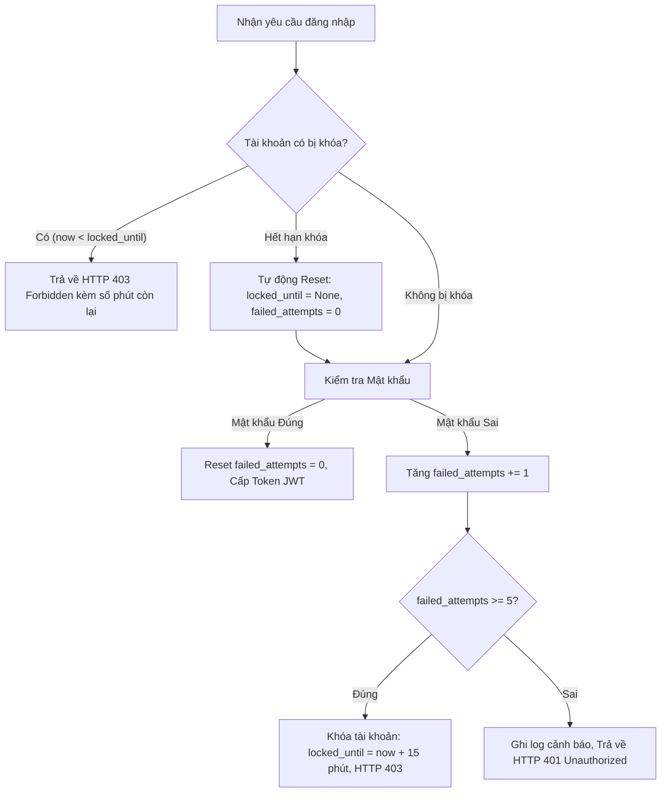

# CHƯƠNG 2: CHÍNH SÁCH MẬT KHẨU VÀ CÁC CƠ CHẾ PHÒNG THỦ BRUTE FORCE

## 2.1. Chính sách mật khẩu (Password Policy) là gì?

**Định nghĩa**: Chính sách mật khẩu là tập hợp các quy định kỹ thuật và nguyên tắc bắt buộc mà hệ thống áp dụng để kiểm soát việc tạo lập, sử dụng và bảo dưỡng mật khẩu của người dùng, bao gồm:
- **Độ dài tối thiểu và tối đa** (Minimum & Maximum Length).
- **Yêu cầu về độ phức tạp** (Complexity Requirements): Bắt buộc chứa các nhóm ký tự khác nhau (chữ hoa, chữ thường, chữ số, ký tự đặc biệt).
- **Ngăn chặn mật khẩu phổ biến / yếu** (Common Passwords Blacklist).
- **Giới hạn tái sử dụng mật khẩu cũ** (Password History).
- **Hành động phản ứng khi vi phạm** (Từ chối khởi tạo, cảnh báo vi phạm, ghi log kiểm toán).

### Vai trò của chính sách mật khẩu trong an toàn hệ thống:
1. **Mở rộng không gian khóa (Keyspace)**: Buộc không gian tổ hợp mật khẩu phải đủ lớn, khiến thời gian tính toán của kẻ tấn công vét cạn tăng lên cấp số nhân và trở nên bất khả thi trong thực tế.
2. **Loại bỏ điểm yếu từ mật khẩu mặc định và mật khẩu thông dụng**: Ngăn chặn người dùng đặt các chuỗi ký tự đơn giản như `123456`, `admin123` hay trùng với `username`.
3. **Phối hợp phòng thủ đa tầng (Defense-in-Depth)**: Chính sách mật khẩu mạnh là tuyến phòng thủ lõi, khi kết hợp với Account Lockout, Rate Limiting và CAPTCHA sẽ tạo thành pháo đài vững chắc bảo vệ hệ thống xác thực.
4. **Đáp ứng các tiêu chuẩn an toàn thông tin quốc tế**: Tuân thủ hướng dẫn định danh số của NIST SP 800-63B, ISO/IEC 27001 và PCI-DSS.

---

## 2.2. Tiêu chuẩn của một mật khẩu mạnh

### 2.2.1. Yếu tố độ dài (Minimum Length)
- **Tầm quan trọng**: Độ dài là yếu tố quyết định hàng đầu trong việc gia tăng độ an toàn của mật khẩu.
- **Tác động toán học**: Khi tăng thêm mỗi ký tự cho mật khẩu, số phép thử mà kẻ tấn công phải duyệt qua sẽ được nhân lên với kích thước của bộ ký tự ($C$).
- **So sánh trực quan**:
  - Mật khẩu 6 ký tự chỉ gồm chữ số: $10^6 = 1.000.000$ tổ hợp (bẻ khóa trong vòng < 1 giây).
  - Mật khẩu 8 ký tự chỉ gồm chữ số: $10^8 = 100.000.000$ tổ hợp (tăng 100 lần).
  - Mật khẩu 8 ký tự chữ cái thường (a-z): $26^8 \approx 2{,}08 \times 10^{11}$ tổ hợp.
  - Mật khẩu 8 ký tự kết hợp đầy đủ 4 nhóm: $94^8 \approx 6{,}09 \times 10^{15}$ tổ hợp.

### 2.2.2. Yếu tố độ phức tạp (Character Diversity)
Bộ ký tự tiêu chuẩn trong mật mã học máy tính thường phân tách thành 4 nhóm:
1. Chữ cái viết thường (Lowercase): `a - z` (26 ký tự)
2. Chữ cái viết hoa (Uppercase): `A - Z` (26 ký tự)
3. Chữ số thập phân (Digits): `0 - 9` (10 ký tự)
4. Ký tự đặc biệt (Special Symbols): `!@#$%^&*(),.?":{}|<>` (khoảng 32 ký tự)

Khi một chính sách mật khẩu yêu cầu bắt buộc xuất hiện ít nhất một ký tự từ mỗi nhóm, không gian bộ ký tự hữu dụng mở rộng từ 26 ký tự lên 94 ký tự. Điều này khiến kẻ tấn công không thể thu hẹp không gian tìm kiếm về chỉ chữ thường hoặc chỉ số.

### 2.2.3. Khuyến nghị từ tiêu chuẩn NIST SP 800-63B
Tiêu chuẩn **NIST Special Publication 800-63B (Digital Identity Guidelines)** đưa ra các khuyến nghị hiện đại:
- **Độ dài tối thiểu**: Bắt buộc tối thiểu $\ge 8$ ký tự cho các hệ thống thông thường, và khuyến khích $\ge 12$ ký tự cho tài khoản đặc quyền (Admin).
- **Kiểm tra danh sách đen (Blacklist Check)**: Hệ thống phải tự động từ chối các mật khẩu nằm trong danh sách rò rỉ phổ biến, mật khẩu mặc định của thiết bị, hoặc mật khẩu chứa thông tin ngữ cảnh cá nhân (như chính tên đăng nhập `username`).
- **Giao diện trực quan (UI Feedback)**: Cung cấp thanh đo độ mạnh (Password Strength Meter) và danh mục kiểm tra tiêu chuẩn theo thời gian thực để hướng dẫn người dùng thiết lập mật khẩu đạt chuẩn trước khi gửi yêu cầu.

### 2.2.4. Chính sách được triển khai trong dự án (Nhánh `fix_policy`):
- **Quy tắc kiểm tra backend**:
  - Độ dài tối thiểu: $\ge 8$ ký tự (tối đa 100 ký tự).
  - Bắt buộc chứa ít nhất: 1 chữ hoa, 1 chữ thường, 1 chữ số và 1 ký tự đặc biệt.
  - Xử lý thông báo lỗi chi tiết qua Pydantic validator, trả về mã lỗi HTTP 400 rõ ràng.
- **Giao diện frontend**:
  - Tích hợp component `PasswordStrengthMeter` hiển thị thanh tiến trình 5 cấp độ (*Rất yếu $\rightarrow$ Yếu $\rightarrow$ Trung bình $\rightarrow$ Khá $\rightarrow$ Mạnh đạt chuẩn*).
  - Danh mục kiểm tra trực quan (Checklist) hiển thị icon đánh dấu trạng thái đạt/chưa đạt của 5 tiêu chí.

---

## 2.3. Cơ chế Khóa tài khoản (Account Lockout Policy)

**Định nghĩa**: Account Lockout là cơ chế bảo mật tự động vô hiệu hóa quyền đăng nhập của một tài khoản cụ thể trong một khoảng thời gian xác định sau khi tài khoản đó ghi nhận liên tiếp nhiều lần đăng nhập không thành công.

### 2.3.1. Thuật toán hoạt động của Account Lockout:

### 2.3.2. Cấu hình tham số trong dự án:
- `MAX_FAILED_ATTEMPTS = 5`: Cho phép người dùng nhập sai tối đa 5 lần liên tiếp.
- `LOCKOUT_DURATION_MINUTES = 15`: Khóa tài khoản trong thời gian 15 phút.
- **Cơ sở lựa chọn tham số**:
  - *5 lần*: Đủ dự phòng cho người dùng thật gõ nhầm hoặc quên mật khẩu, nhưng cực kỳ chặt chẽ trước các công cụ dò quét tự động (vốn cần gửi hàng ngàn request).
  - *15 phút*: Đủ dài để triệt tiêu hiệu quả của các đợt tấn công từ điển (khiến việc thử 1.000 mật khẩu mất hơn 50 giờ thay vì vài giây), đồng thời đủ ngắn để người dùng hợp pháp có thể tự phục hồi phiên làm việc mà không làm gián đoạn trải nghiệm quá mức.

### 2.3.3. Đánh giá ưu và nhược điểm:
- **Ưu điểm**:
  - Triệt tiêu hoàn toàn kỹ thuật tấn công đoán mật khẩu liên tục (Infinite Guessing) trên cùng một tài khoản.
  - Tự động mở khóa theo thời gian, không đòi hỏi sự can thiệp thủ công từ quản trị viên.
  - Ghi vết kiểm toán (Audit Log) rõ ràng phục vụ công tác điều tra an ninh.
- **Rủi ro tiềm ẩn (Account Denial of Service)**:
  - Kẻ tấn công có thể cố tình gửi 5 request sai liên tiếp cho tài khoản của Giám đốc hoặc Admin nhằm ngăn cản người dùng thật đăng nhập (tấn công từ chối dịch vụ tài khoản).
  - **Biện pháp khắc phục**: Kết hợp chặt chẽ với cơ chế Rate Limiting theo địa chỉ IP và mã CAPTCHA để kẻ tấn công không thể dễ dàng gửi request quấy rối hàng loạt.

---

## 2.4. Các cơ chế phòng thủ bổ sung (Defense-in-Depth)

### 2.4.1. Giới hạn tần suất yêu cầu (Rate Limiting)
- **Nguyên lý hoạt động**: Giám sát số lượng yêu cầu HTTP gửi đến từ một địa chỉ IP client trong một khung thời gian trượt (Sliding Window):
  - *Endpoint công khai*: Tối đa 10 requests / 60 giây.
  - *Endpoint xác thực (`/api/auth/*`)*: Tối đa 5 requests / 15 phút (900 giây) trên mỗi IP. Khi vượt ngưỡng, hệ thống trả về HTTP 429 Too Many Requests.
- **Vá lỗ hổng giả mạo IP**: Loại bỏ việc tin cậy mù quáng header `X-Forwarded-For` từ client gửi lên và xóa bỏ hoàn toàn backdoor bí mật `testclient`, chỉ sử dụng IP kết nối socket trực tiếp (`request.client.host`).

### 2.4.2. Cơ chế CAPTCHA tự sinh nội bộ (Self-contained SVG Math CAPTCHA)
- **Định nghĩa**: Thử thách Turing công khai tự động để phân biệt con người và máy tính (Completely Automated Public Turing test to tell Computers and Humans Apart).
- **Giải pháp trong đề tài**: Nhóm đã thiết kế một giải pháp CAPTCHA nội bộ độc lập (Self-contained), không phụ thuộc vào dịch vụ bên thứ ba (như Google reCAPTCHA hay Cloudflare Turnstile vốn cần API Key Internet):
  - *Độ an toàn*: Phép toán ngẫu nhiên (cộng, trừ, nhân 2 số) được sinh động và render trực tiếp thành **hình ảnh vector SVG** với các đường cong sóng lượn và chấm nhiễu chống OCR cơ bản.
  - *Tính toàn vẹn (Stateless Security)*: Đáp án đúng được mã hóa và ký số bằng JWT (HMAC-SHA256 với `SECRET_KEY`) kèm thời hạn 5 phút. Máy chủ không cần lưu session/cache vào RAM, đảm bảo khả năng mở rộng container.
  - *Tích hợp giao diện*: Hiển thị trực tiếp trong modal đăng nhập/đăng ký với nút làm mới mã (Refresh) mượt mà; tự động đổi mã mới khi nhập sai để chống tấn công replay.

### 2.4.3. Phòng chống tấn công phân tích thời gian phản hồi (Timing Attack Mitigation)
- **Vấn đề**: Việc băm mật khẩu bằng Bcrypt tiêu tốn khoảng 150-250ms CPU. Nếu tài khoản không tồn tại mà hệ thống phản hồi ngay sau 2ms, kẻ tấn công đo thời gian phản hồi (Round-trip Time) có thể khẳng định tài khoản nào có thật trên hệ thống (User Enumeration).
- **Giải pháp**: Tạo sẵn một chuỗi hash giả lập `DUMMY_PASSWORD_HASH`. Khi tài khoản không tồn tại, hàm `verify_password()` vẫn được thực thi đầy đủ chu kỳ băm Bcrypt giả lập, đảm bảo thời gian phản hồi luôn đồng nhất (~150-250ms) trong mọi trường hợp.

### 2.4.4. Tổng quan mô hình phòng thủ theo chiều sâu (Defense-in-Depth):
Mô hình an ninh triển khai trên nhánh `fix_policy` tạo thành 4 lớp bảo vệ liên hoàn:
1. **Lớp 1 - CAPTCHA & Rate Limiting**: Chặn đứng các công cụ botnet và tool tự động gửi request hàng loạt từ một IP.
2. **Lớp 2 - Timing Attack Mitigation & IDOR Protection**: Ngăn chặn kẻ tấn công do thám và thu thập danh sách tài khoản hợp lệ.
3. **Lớp 3 - Account Lockout**: Chặn đứng việc dò đoán mật khẩu nhiều lần trên cùng một tài khoản đích.
4. **Lớp 4 - Chính sách mật khẩu mạnh**: Đảm bảo không gian khóa đủ lớn để ngay cả khi lọt qua các lớp trên, mật khẩu cũng không thể bị vét cạn bằng từ điển thông thường.