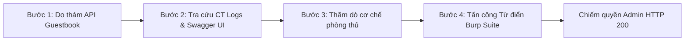

# CHƯƠNG 3: TRIỂN KHAI KỊCH BẢN TẤN CÔNG THỰC NGHIỆM

## 3.1. Thiết lập môi trường thử nghiệm

### 3.1.1. Kiến trúc hệ thống mục tiêu (Target System)
- **Môi trường container**: Đóng gói hoàn chỉnh bằng Docker Compose gồm các dịch vụ độc lập:
  - *Frontend Web*: Ứng dụng React 18 / TypeScript / Tailwind CSS, lắng nghe trên cổng 8080 nội bộ, phục vụ giao diện Sổ lưu bút và Hồ sơ cá nhân.
  - *Backend API*: Ứng dụng Python FastAPI, lắng nghe trên cổng 7000 nội bộ, kết nối cơ sở dữ liệu SQLite (`guestbook.db`).
  - *Tailscale Proxy Containers (`chat` và `chat_ts`)*: Kết nối mạng riêng ảo Tailscale để công khai ứng dụng ra Internet.
- **Triển khai trên Tên miền thật (Public URL & SSL/TLS)**:
  - Thay vì thử nghiệm cục bộ trên `localhost`, toàn bộ hệ thống được triển khai trên **tên miền thật có chứng chỉ bảo mật HTTPS** thông qua công nghệ **Tailscale Funnel**:
    - Giao diện người dùng (Frontend): `https://chat.taild6d848.ts.net/`
    - Giao diện lập trình ứng dụng (Backend API): `https://chat-ts.taild6d848.ts.net/`
  - Việc kiểm thử trên môi trường Internet thực tế giúp đánh giá chính xác độ trễ mạng, tính hợp lệ của chứng chỉ SSL/TLS và các cơ chế proxy headers trong thực tế.

### 3.1.2. Công cụ tấn công sử dụng trong đề tài
- **Burp Suite Professional / Community Edition**:
  - Web Proxy bắt giữ và kiểm tra lưu lượng HTTP/HTTPS giữa client và máy chủ.
  - Module **Intruder**: Tự động hóa quá trình gửi hàng loạt yêu cầu xác thực với danh sách từ điển mẫu.
  - HTTP Match & Replace: Bổ sung các header tùy chỉnh (như `X-Forwarded-For`).
- **Trình duyệt Web (Google Chrome / Firefox Developer Tools)**: Khảo sát mã nguồn client, kiểm tra tab Network và Console.
- **Công cụ tra cứu Certificate Transparency Logs (CT Logs)**: Công cụ trực tuyến (như `certkit.io/tools/ct-logs`) dùng để do thám và phát hiện subdomain backend ẩn của mục tiêu.

---

## 3.2. Xây dựng danh sách từ điển mật khẩu (Wordlist)

Kẻ tấn công sử dụng file từ điển `passwords.txt` tổng hợp các mật khẩu phổ biến nhất trong các cơ sở dữ liệu rò rỉ thế giới, bao gồm cả mật khẩu mặc định của hệ thống:

```text
123456
password
12345678
qwerty
123456789
12345
1234
111111
1234567
dragon
123123
baseball
abc123
football
monkey
letmein
shadow
master
654321
superman
1qaz2wsx
67890
michael
batman
trustno1
admin
admin123
administrator
root
toor
guest
demo
test
```

> **Ghi chú phân tích:** Mật khẩu `admin123` (mật khẩu mặc định của tài khoản quản trị khi khởi tạo hệ thống trên nhánh `main`) được cố tình sắp xếp ở vị trí thứ 27 trong danh sách. Điều này giúp quan sát rõ ràng quá trình công cụ gửi liên tiếp 26 yêu cầu thất bại trước khi bắt được mã thành công.

---

## 3.3. Các bước tiến hành chuỗi tấn công (Attack Kill Chain)

Cuộc tấn công trên nhánh chưa vá lỗi (`main`) được thực hiện tuần tự qua 4 bước:



### Bước 1: Do thám và xác định tài khoản mục tiêu (Reconnaissance)
1. Kẻ tấn công truy cập trang web `https://chat.taild6d848.ts.net/` với tư cách khách vãng lai.
2. Mở Công cụ nhà phát triển (F12) $\rightarrow$ Tab **Network**.
3. Khi xem danh sách lời nhắn trong Sổ lưu bút, hệ thống gửi yêu cầu `GET /api/guestbook`.
4. Quan sát cấu trúc JSON phản hồi từ máy chủ:
   ```json
   [
     {
       "id": 1,
       "author_name": "admin",
       "author_role": "admin",
       "user_id": 1,
       "content": "Chào mừng bạn đến với Guestbook!"
     }
   ]
   ```
5. **Kết luận của kẻ tấn công**:
   - Hệ thống có phân quyền vai trò (`author_role`).
   - Tồn tại tài khoản quản trị tối cao với tên đăng nhập xác thực là **`admin`** (`user_id = 1`).
   - Kẻ tấn công thu hẹp 100% mục tiêu vào việc dò tìm mật khẩu của tài khoản `admin`.

---

### Bước 2: Dò quét Subdomain ẩn và khai thác tài liệu Swagger UI
1. Trên giao diện frontend `https://chat.taild6d848.ts.net/`, kẻ tấn công thử truy cập `/docs` nhưng nhận phản hồi **HTTP 404 Not Found** (do Nginx chỉ chuyển tiếp đường dẫn `/api`).
2. Kẻ tấn công sử dụng công cụ tra cứu **Certificate Transparency Logs (CT Logs)** tại `https://www.certkit.io/tools/ct-logs/` cho domain gốc `taild6d848.ts.net`.
3. Do Let's Encrypt bắt buộc công khai toàn bộ chứng chỉ SSL đã cấp phát, kẻ tấn công nhanh chóng phát hiện ra sự tồn tại của subdomain backend độc lập:
   $$\text{Subdomain Backend: } \mathbf{chat-ts.taild6d848.ts.net}$$
4. Kẻ tấn công truy cập trực tiếp `https://chat-ts.taild6d848.ts.net/docs` và mở ra toàn bộ tài liệu **Swagger UI**.
5. **Phát hiện quan trọng**: Trên giao diện web, form đăng nhập sử dụng mã hóa RSA + AES phức tạp (`/api/auth/login`). Tuy nhiên, tài liệu Swagger để lộ một endpoint xác thực thay thế chuẩn OAuth2:
   $$\mathbf{POST\ /api/auth/token}$$
   Endpoint này nhận dữ liệu thuần `application/x-www-form-urlencoded` với 2 tham số: `username` và `password`. Điều này cho phép kẻ tấn công gửi trực tiếp mật khẩu dạng rõ (Plaintext) bằng các công cụ tự động mà không cần giải mã JavaScript hay RSA.

---

### Bước 3: Thăm dò cơ chế phòng thủ của hệ thống
1. Kẻ tấn công gửi thử nghiệm 5 - 10 request đăng nhập sai liên tiếp tới `POST /api/auth/token`.
2. **Hiện tượng ghi nhận**:
   - Tất cả các request đều trả về mã lỗi **HTTP 401 Unauthorized** kèm thông điệp: `"Tên đăng nhập hoặc mật khẩu không đúng"`.
   - Không xuất hiện mã lỗi khóa tài khoản (HTTP 403), tài khoản `admin` vẫn cho phép tiếp tục thử nghiệm không giới hạn.
   - Thử nghiệm vượt cơ chế giới hạn tần suất (Rate Limiting) bằng cách chèn header:
     ```http
     X-Forwarded-For: testclient
     ```
     Hệ thống chấp nhận header này và bỏ qua hoàn toàn bộ đếm tần suất.
3. **Kết luận**: Hệ thống nạn nhân trên nhánh `main` hoàn toàn không có Account Lockout và cơ chế Rate Limiting tồn tại backdoor bypass nghiêm trọng.

---

### Bước 4: Thực hiện Tấn công Từ điển với Burp Suite Intruder
1. Kẻ tấn công cấu hình Burp Suite Proxy để chặn bắt gói tin đăng nhập gửi tới `https://chat-ts.taild6d848.ts.net/api/auth/token`.
2. Chuyển gói tin sang module **Intruder** (`Ctrl + I`):
   - **Target**: Host `chat-ts.taild6d848.ts.net`, Port `443`, giao thức HTTPS.
   - **Attack type**: Chọn chế độ **Sniper**.
   - **Positions**: Đánh dấu vị trí payload tại trường password:
     ```http
     POST /api/auth/token HTTP/1.1
     Host: chat-ts.taild6d848.ts.net
     X-Forwarded-For: testclient
     Content-Type: application/x-www-form-urlencoded

     username=admin&password=§password§
     ```
   - **Payloads**: Nạp danh sách từ file `passwords.txt`.
3. Bấm **Start Attack** và theo dõi bảng kết quả.

---

## 3.4. Kết quả thực nghiệm tấn công trên nhánh `main`

### Bảng kết quả ghi nhận từ Burp Suite Intruder:

| Request # | Payload (Mật khẩu thử) | HTTP Status | Content-Length | Đánh giá phản hồi |
| :---: | :--- | :---: | :---: | :--- |
| 1 | `123456` | **401 Unauthorized** | 48 | Sai mật khẩu, hệ thống từ chối |
| 2 | `password` | **401 Unauthorized** | 48 | Sai mật khẩu, hệ thống từ chối |
| ... | ... | **401 Unauthorized** | 48 | ... |
| 26 | `admin` | **401 Unauthorized** | 48 | Sai mật khẩu, hệ thống từ chối |
| **27** | **`admin123`** | **200 OK** | **382** | **Xác thực thành công, cấp Token JWT!** |
| 28 | `administrator` | 401 Unauthorized | 48 | Tiếp tục thử nếu không dừng |

### Phân tích gói tin bẻ khóa thành công:
Tại dòng thử thứ 27 với mật khẩu `admin123`:
1. Mã trạng thái HTTP đột ngột chuyển từ **401** sang **200 OK**.
2. Chiều dài gói tin tăng vọt từ 48 bytes lên **382 bytes**.
3. Phản hồi trả về kèm Cookie bảo mật chứa chuỗi `access_token`:
   ```json
   {
     "user": {
       "id": 1,
       "username": "admin",
       "role": "admin"
     }
   }
   ```
4. Kẻ tấn công trích xuất token này nạp vào trình duyệt hoặc gửi trực tiếp trong header `Cookie: access_token=...` để thực hiện toàn quyền quản trị (xóa/sửa bài viết của người khác, thay đổi cấu hình hệ thống).

### Kết luận Kịch bản 1:
Cuộc tấn công từ điển đã bẻ khóa thành công tài khoản quản trị `admin` chỉ sau chưa đầy **3 giây** với 27 request. Nguyên nhân trực tiếp là do:
- Mật khẩu mặc định yếu (`admin123`).
- Thiếu cơ chế khóa tài khoản khi nhập sai liên tiếp.
- Rate Limiting bị qua mặt hoàn toàn bởi header giả mạo.
- Thiếu cơ chế CAPTCHA ngăn chặn công cụ tự động.