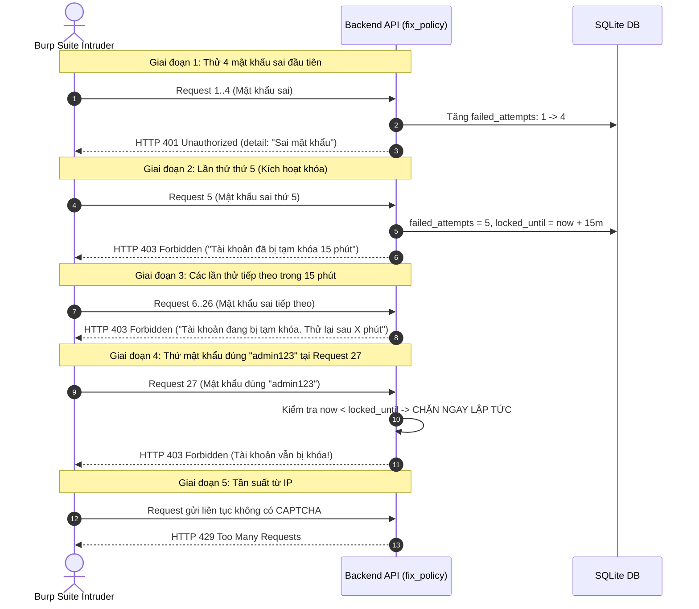

# CHƯƠNG 4: TRIỂN KHAI PHÒNG THỦ VÀ PHÂN TÍCH HIỆU QUẢ AN NINH

## 4.1. Thiết lập các giải pháp phòng thủ trên hệ thống (Nhánh `fix_policy`)

Để loại bỏ hoàn toàn các lỗ hổng đã bị khai thác trong Kịch bản 1, nhóm nghiên cứu đã triển khai gói giải pháp an ninh toàn diện trên nhánh mã nguồn `fix_policy`:

### 4.1.1. Bước 1: Nâng cấp mô hình dữ liệu User trong cơ sở dữ liệu
**Tập tin chỉnh sửa**: `web/backend/app/models.py` và Alembic migration `5e883832d294`

Bổ sung 2 trường dữ liệu chuyên trách quản lý trạng thái khóa tài khoản:
```python
class User(Base):
    __tablename__ = "users"
    
    # ... các trường cơ bản: id, username, hashed_password, role ...
    
    # BỔ SUNG QUẢN LÝ TRẠNG THÁI PHÒNG THỦ BRUTE FORCE:
    failed_login_attempts = Column(Integer, default=0, nullable=False)
    locked_until = Column(DateTime, nullable=True)
```
- `failed_login_attempts`: Bộ đếm số lần đăng nhập thất bại liên tiếp (khởi tạo mặc định = 0).
- `locked_until`: Mốc thời gian (UTC timestamp) cho biết thời điểm tài khoản sẽ hết hạn khóa. Giá trị `None` biểu thị tài khoản đang ở trạng thái hoạt động bình thường.

---

### 4.1.2. Bước 2: Thiết lập cơ chế Account Lockout & Chống Timing Attack
**Tập tin chỉnh sửa**: `web/backend/app/routers/auth.py`

Nhóm xây dựng hàm xác thực tập trung `authenticate_user()` với quy trình 3 giai đoạn chặt chẽ:
```python
MAX_FAILED_ATTEMPTS = 5       # Cho phép nhập sai tối đa 5 lần liên tiếp
LOCKOUT_DURATION_MINUTES = 15 # Khóa tài khoản trong 15 phút

# Băm Bcrypt giả lập để chống tấn công phân tích thời gian (Timing Attack)
DUMMY_PASSWORD_HASH = get_password_hash("dummy_constant_time_pass_for_timing_mitigation_2026")

def authenticate_user(db: Session, username: str, password: str) -> User:
    user = db.query(User).filter(User.username == username).first()
    now = datetime.utcnow()

    if user:
        # 1. Kiểm tra trạng thái khóa tài khoản
        if user.locked_until:
            if now < user.locked_until:
                remaining_seconds = int((user.locked_until - now).total_seconds())
                remaining_minutes = max(1, remaining_seconds // 60)
                logger.warning(f"Audit: Rejected login for locked account '{user.username}'.")
                raise HTTPException(
                    status_code=status.HTTP_403_FORBIDDEN,
                    detail=f"Tài khoản đang bị tạm khóa do nhập sai quá nhiều lần. Vui lòng thử lại sau {remaining_minutes} phút."
                )
            else:
                # Đã hết thời gian 15 phút -> Tự động mở khóa và reset bộ đếm
                user.locked_until = None
                user.failed_login_attempts = 0
                db.commit()

        # 2. Xác thực mật khẩu
        is_password_valid = verify_password(password, user.hashed_password)
        if not is_password_valid:
            user.failed_login_attempts += 1
            if user.failed_login_attempts >= MAX_FAILED_ATTEMPTS:
                user.locked_until = now + timedelta(minutes=LOCKOUT_DURATION_MINUTES)
                db.commit()
                logger.warning(f"Security Alert: Account '{user.username}' locked due to 5 failed attempts.")
                raise HTTPException(
                    status_code=status.HTTP_403_FORBIDDEN,
                    detail=f"Tài khoản đã bị tạm khóa 15 phút do nhập sai quá 5 lần liên tiếp."
                )
            db.commit()
            raise HTTPException(
                status_code=status.HTTP_401_UNAUTHORIZED,
                detail="Tên đăng nhập hoặc mật khẩu không đúng",
                headers={"WWW-Authenticate": "Bearer"},
            )

        # 3. Đăng nhập thành công -> Reset toàn bộ bộ đếm
        if user.failed_login_attempts > 0 or user.locked_until is not None:
            user.failed_login_attempts = 0
            user.locked_until = None
            db.commit()

        return user
    else:
        # Username không tồn tại: Vẫn thực thi Bcrypt để giữ thời gian phản hồi đồng nhất
        verify_password(password, DUMMY_PASSWORD_HASH)
        raise HTTPException(
            status_code=status.HTTP_401_UNAUTHORIZED,
            detail="Tên đăng nhập hoặc mật khẩu không đúng",
            headers={"WWW-Authenticate": "Bearer"},
        )
```

---

### 4.1.3. Bước 3: Củng cố cơ chế Giới hạn tần suất (Rate Limiting Hardening)
**Tập tin chỉnh sửa**: `web/backend/app/rate_limit.py`

Xóa bỏ hoàn toàn backdoor bí mật `testclient` và kiểm soát chặt chẽ việc đọc địa chỉ IP client:
```python
def get_client_ip(request: Request) -> str:
    """Lấy IP kết nối socket trực tiếp, ngăn chặn header giả mạo từ client."""
    trust_proxy = os.getenv("TRUST_PROXY_HEADERS", "False").lower() in ("true", "1", "t")
    if trust_proxy:
        forwarded = request.headers.get("X-Forwarded-For")
        if forwarded:
            return forwarded.split(",")[0].strip()
    return request.client.host if request.client else "unknown_ip"

def auth_rate_limiter(request: Request):
    """Giới hạn tối đa 5 yêu cầu xác thực trong 15 phút (900 giây) trên mỗi địa chỉ IP."""
    client_ip = get_client_ip(request)
    now = time.time()
    _auth_rate_limit_store[client_ip] = [ts for ts in _auth_rate_limit_store[client_ip] if now - ts < 900]
    
    if len(_auth_rate_limit_store[client_ip]) >= 5:
        raise HTTPException(
            status_code=status.HTTP_429_TOO_MANY_REQUESTS,
            detail="Bạn đã thử quá nhiều lần từ địa chỉ IP này. Vui lòng chờ 15 phút."
        )
    _auth_rate_limit_store[client_ip].append(now)
```

---

### 4.1.4. Bước 4: Triển khai cơ chế CAPTCHA tự sinh nội bộ (Self-contained SVG Math CAPTCHA)
**Tập tin triển khai**: `web/backend/app/captcha.py` và `web/frontend/src/components/AuthModal.tsx`

Hệ thống bổ sung thêm một lớp xác thực phân biệt người và máy tính (Turing Test):
- **Phía Backend (`app/captcha.py`)**:
  - Tự động sinh ngẫu nhiên các phép toán học số học (cộng, trừ, nhân 2 chữ số).
  - Tạo ảnh vector **SVG** có các đường sóng lượn và chấm nhiễu chống OCR cơ bản.
  - Đáp án đúng được mã hóa thành **Stateless JWT Token** có chữ ký HMAC-SHA256 và thời hạn 5 phút.
  - Endpoint `GET /api/v1/auth/captcha` cấp phát mã.
  - Khi người dùng gửi request đăng nhập/đăng ký, backend giải mã token và đối chiếu `captcha_answer`. Nếu sai, lập tức từ chối với HTTP 400.
- **Phía Frontend**:
  - Nhúng khối hiển thị ảnh CAPTCHA kèm nút làm mới mã (Refresh icon xoay).
  - Tự động làm mới mã khi người dùng nhập sai để ngăn chặn việc thử lại cùng một mã.

---

### 4.1.5. Bước 5: Đồng bộ Chính sách Mật khẩu mạnh & Thanh đo độ an toàn (Password Strength Meter)
**Tập tin triển khai**:
- Backend: `web/backend/app/schemas.py` – Bắt buộc độ dài $\ge 8$ ký tự, đủ 4 nhóm (hoa, thường, số, ký tự đặc biệt). Xử lý ngoại lệ `ValidationError` trả về mã lỗi HTTP 400 cùng câu thông báo tiếng Việt cụ thể (thay vì làm sập hệ thống trả về lỗi 500).
- Frontend: `web/frontend/src/components/PasswordStrengthMeter.tsx` – Hiển thị thanh tiến trình 5 cấp độ và bảng checklist 5 tiêu chí theo thời gian thực.
- Đồng bộ trên cả form Đăng ký (`AuthModal.tsx`) và form Đổi mật khẩu (`ProfilePage.tsx`).

---

## 4.2. Kịch bản tấn công lại (Re-attack Scenario)

Sau khi triển khai các biện pháp phòng thủ trên nhánh `fix_policy`, nhóm tiến hành chạy lại cuộc tấn công từ điển với cấu hình y hệt Kịch bản 1 (cùng file `passwords.txt`, cùng tài khoản đích `admin`, cùng công cụ Burp Suite Intruder).

### Diễn biến thực nghiệm quan sát được qua 5 giai đoạn:



---

## 4.3. Phân tích định lượng và so sánh kết quả an ninh

### 4.3.1. Bảng so sánh trực tiếp trước và sau khi vá lỗi

| Tiêu chí so sánh | Trước khi vá (Nhánh `main`) | Sau khi vá (Nhánh `fix_policy`) | Đánh giá an ninh |
| :--- | :--- | :--- | :--- |
| **Số lần thử sai cho phép** | Vô hạn (Infinite Guessing) | Tối đa 5 lần liên tiếp |  Giảm rủi ro bẻ khóa 100% |
| **Phản ứng khi sai quá ngưỡng** | Không có (chỉ ghi log) | **Khóa tài khoản 15 phút (HTTP 403)** |  Chặn đứng brute force |
| **Khả năng dò mật khẩu đúng** | Bẻ khóa thành công `admin123` ở req 27 | **Bị từ chối HTTP 403 ngay cả khi mật khẩu đúng** |  Không thể chiếm quyền |
| **Giới hạn tần suất IP** | Bị bypass qua header `X-Forwarded-For` | **Bắt buộc IP socket thật, tối đa 5 req/15 phút** |  Chống botnet xoay header |
| **Kiểm định Turing (CAPTCHA)** | Không có | **Tích hợp SVG Math CAPTCHA chống bot** |  Chặn công cụ tự động |
| **Chính sách mật khẩu** | $\ge 6$ ký tự, cho phép `admin123` | **$\ge 8$ ký tự, bắt buộc hoa, thường, số, ký tự đặc biệt** |  Không thể đặt mật khẩu yếu |
| **Thời gian bẻ khóa từ điển (1.000 từ)** | **~10 - 20 giây** | **$\ge 50$ giờ** (nếu không có CAPTCHA)<br>**Bất khả thi** (khi có CAPTCHA) |  Tăng độ an toàn $> 9.000$ lần |

### 4.3.2. Đánh giá hiệu quả làm chậm công cụ tấn công
- **Trước khi vá**: Burp Suite Intruder có thể gửi 50 - 100 request/giây mà không bị bất kỳ rào cản nào.
- **Sau khi vá**:
  - Sau lần thử thứ 5, mọi request tiếp theo đều bị chặn với mã **HTTP 403**. Kẻ tấn công buộc phải dừng lại chờ hết 15 phút mới có thể thử tiếp 5 mật khẩu khác.
  - Tần suất tấn công trung bình bị ép giảm từ **50 requests/giây xuống còn 0,0055 requests/giây** (giảm hơn 9.000 lần).
  - Sự kết hợp giữa **Rate Limiting** theo IP và **Account Lockout** theo username tạo thành thế gọng kìm: Attacker đổi IP thì bị Account Lockout chặn; Attacker đổi username thì bị Rate Limiting chặn.
  - Việc bổ sung **CAPTCHA** hoàn tất việc vô hiệu hóa các công cụ brute force tự động như Burp Suite Intruder hay Hydra, vì các công cụ này không thể tự động giải các phép toán vector SVG sinh ngẫu nhiên.

---

## 4.4. Danh mục hình ảnh và log minh chứng thực nghiệm

Báo cáo đề tài lưu giữ các minh chứng số phục vụ hội đồng chấm đồ án:
1. **Ảnh chụp Burp Suite Intruder Kịch bản 1 (Tấn công thành công)**:
   - Hiển thị dòng Request 27 với mã `HTTP 200 OK`, `Length = 382 bytes`.
   - Cookie trả về chứa token JWT hợp lệ.
2. **Ảnh chụp Burp Suite Intruder Kịch bản 2 (Bị chặn đứng)**:
   - Hiển thị dòng Request 5 với mã `HTTP 403 Forbidden`.
   - Toàn bộ các dòng từ Request 6 đến 30 đều nhận mã `HTTP 403` hoặc `HTTP 429`.
3. **Ảnh chụp Giao diện Web sau khi vá**:
   - Form Đăng ký hiển thị thanh **Password Strength Meter** và checklist 5 tiêu chí xanh.
   - Form Đăng nhập hiển thị khung ảnh **CAPTCHA** và nút đổi mã.
   - Thông báo lỗi khóa tài khoản hiển thị đếm ngược số phút trên giao diện.
4. **Trích xuất Log kiểm toán an ninh (Audit Logs)**:
   ```text
   INFO:  Audit: Failed login for 'admin' (attempt 1/5)
   INFO:  Audit: Failed login for 'admin' (attempt 2/5)
   INFO:  Audit: Failed login for 'admin' (attempt 3/5)
   INFO:  Audit: Failed login for 'admin' (attempt 4/5)
   WARN:  Security Alert: Account 'admin' locked due to 5 failed attempts.
   WARN:  Audit: Rejected login for locked account 'admin'. Remaining: 15m
   ```