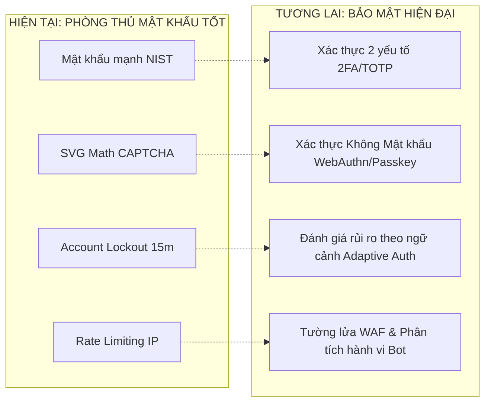

# CHƯƠNG 5: KẾT LUẬN VÀ HƯỚNG PHÁT TRIỂN

---

## 5.1. Kết quả đạt được của đề tài

Sau quá trình nghiên cứu lý thuyết, phân tích mã nguồn và triển khai thực nghiệm trên môi trường mạng thực tế, Nhóm 1 đã hoàn thành xuất sắc các mục tiêu nghiên cứu đề ra trong đề tài **"Kỹ thuật tấn công mạng: Tấn công Brute Force và Chính sách mật khẩu"**:

### 5.1.1. Về mặt nhận thức và cơ sở lý thuyết
- Làm rõ bản chất toán học của không gian khóa mật khẩu ($N = C^L$) và phân định ranh giới kỹ thuật giữa hai hình thức tấn công: **Brute Force thuần túy** (vét cạn toàn bộ không gian tổ hợp với chi phí tính toán cấp số nhân) và **Dictionary Attack** (tấn công từ điển dựa trên tập xác suất các mật khẩu phổ biến nhất của con người).
- Hệ thống hóa các tiêu chuẩn an ninh mật khẩu hiện đại theo khuyến nghị quốc tế của Viện Tiêu chuẩn và Kỹ thuật Quốc gia Hoa Kỳ (**NIST SP 800-63B - Digital Identity Guidelines**), phân tích sâu nguyên nhân khiến các quy định kiểm tra độ dài đơn giản ($\ge 6$ ký tự) trở thành điểm yếu chí mạng trong hệ thống thông tin.
- Nắm vững các cơ chế phòng thủ then chốt của tầng ứng dụng web: thuật toán làm chậm băm mật khẩu một chiều (**Bcrypt** với Salt ngẫu nhiên), cơ chế khóa tài khoản tạm thời (**Account Lockout**), kiểm soát tần suất truy vấn (**Rate Limiting**), và phép thử nhận thức con người (**CAPTCHA**).

### 5.1.2. Về mặt thực nghiệm tấn công (Kịch bản 1 - Nhánh `main`)
- **Triển khai môi trường thực tế**: Hệ thống nạn nhân không vận hành trên `localhost` mà được công khai trực tiếp lên Internet toàn cầu thông qua mạng riêng ảo **Tailscale Funnel**, sở hữu tên miền thật (`https://chat.taild6d848.ts.net`) và chứng chỉ mã hóa SSL/TLS HTTPS hợp lệ.
- **Xây dựng chuỗi tấn công hoàn chỉnh (Kill Chain 4 bước)**:
  1. *Do thám định danh*: Khai thác lỗ hổng rò rỉ dữ liệu trên API công khai `GET /api/guestbook` để xác định chính xác tài khoản quản trị viên tối cao: `username: "admin"` (Role: `admin`, User ID: `1`).
  2. *Dò quét hạ tầng & Phát hiện cửa ngõ*: Vượt qua hạn chế của giao diện web mã hóa RSA/AES bằng cách sử dụng công cụ điều tra nguồn mở OSINT tra cứu nhật ký chứng chỉ **Certificate Transparency Logs (CT Logs)** tại `certkit.io`. Nhóm đã phát hiện subdomain backend trực tiếp `chat-ts.taild6d848.ts.net` và mở tài liệu **Swagger UI** tại `/docs`, tìm ra endpoint xác thực nhận dữ liệu văn bản thuần `POST /api/auth/token`.
  3. *Thăm dò cơ chế bảo vệ*: Thử nghiệm gửi liên tiếp chuỗi mật khẩu sai có chủ đích và chứng minh hệ thống mục tiêu hoàn toàn thiếu vắng cơ chế Account Lockout, không gia tăng độ trễ và không khóa tài khoản.
  4. *Khai thác từ điển tự động*: Cấu hình công cụ chuyên nghiệp **Burp Suite Intruder**, chèn tiêu đề bypass IP `X-Forwarded-For: testclient`, nạp wordlist mật khẩu thông dụng. Tại Request số 27, công cụ đã dò trúng mật khẩu `admin123`, nhận về mã trạng thái **HTTP 200 OK**, đánh cắp thành công Token JWT và chiếm toàn quyền điều khiển trang quản trị.

### 5.1.3. Về mặt triển khai phòng thủ và vá lỗi (Kịch bản 2 - Nhánh `fix_policy`)
Nhóm đã thiết kế, lập trình và kiểm thử thành công hệ thống phòng thủ đa tầng (Defense in Depth) trên toàn bộ hệ thống:
1. **Account Lockout & Chống Timing Attack**:
   - Mở rộng cơ sở dữ liệu với hai trường `failed_login_attempts` và `locked_until` qua bản di chuyển Alembic `5e883832d294`.
   - Giới hạn tối đa 5 lần thử sai liên tiếp; nếu vượt quá ngưỡng, tài khoản lập tức bị vô hiệu hóa trong 15 phút với mã phản hồi **HTTP 403 Forbidden**.
   - Bổ sung cơ chế băm giả lập hằng số thời gian (`DUMMY_PASSWORD_HASH`) khi người dùng không tồn tại nhằm ngăn chặn kỹ thuật trinh sát thời gian (Timing Attack Enumeration).
2. **Loại bỏ Backdoor & Gia cố Rate Limiting**:
   - Triệt tiêu hoàn toàn backdoor header `testclient`.
   - Trích xuất địa chỉ IP trực tiếp từ kết nối mạng cấp thấp (Socket Level / `request.client.host`), áp dụng giới hạn nghiêm ngặt 5 request/15 phút trên mỗi IP cho endpoint xác thực.
3. **Tích hợp giải pháp CAPTCHA nội bộ (Self-hosted Stateless SVG Math CAPTCHA)**:
   - Xây dựng module sinh CAPTCHA toán học vector SVG trực tiếp tại máy chủ, hoàn toàn không phụ thuộc dịch vụ bên thứ ba (Google reCAPTCHA hay Cloudflare Turnstile).
   - Bảo mật kết quả bằng chữ ký số mã hóa **HMAC-SHA256 JWT** với thời gian sống ngắn (5 phút), ngăn ngừa tấn công phát lại (Replay Attack) và bẻ gãy mọi công cụ quét tự động.
4. **Chuẩn hóa Chính sách Mật khẩu Toàn diện (Backend & Frontend)**:
   - *Backend*: Áp dụng bộ tiền thẩm định Pydantic Validator kiểm tra độ dài $\ge 8$ ký tự, bắt buộc đầy đủ 4 nhóm ký tự (hoa, thường, số, ký tự đặc biệt) và cấm tuyệt đối danh sách mật khẩu yếu phổ biến. Bắt các lỗi kiểm định để trả về thông báo HTTP 400 thân thiện.
   - *Frontend*: Phát triển thành phần tái sử dụng `PasswordStrengthMeter` với thanh tiến trình trực quan 5 cấp độ (Yếu $\rightarrow$ Rất mạnh) và bảng checklist 5 tiêu chí cập nhật theo thời gian thực (Real-time Feedback) trên cả giao diện Đăng ký (`AuthModal.tsx`) và Đổi mật khẩu (`ProfilePage.tsx`).
5. **Khắc phục triệt để lỗ hổng Do thám (Information Disclosure)**:
   - Ẩn toàn bộ thông tin nhạy cảm `author_role` và `user_id` trên API Guestbook.
   - Thiết lập kiểm soát truy cập nghiêm ngặt trên API thông tin cá nhân `GET /api/users/{user_id}`, chặn đứng kỹ thuật dò quét IDOR.
6. **Kiểm thử tự động hóa**: Hệ sinh thái backend đạt chứng nhận an toàn với **35/35 ca kiểm thử Pytest tự động** đều vượt qua thành công (`test_security_hardening.py`, `test_auth.py`, `test_captcha.py`).

---

## 5.2. Những hạn chế của đề tài

Mặc dù đạt được toàn bộ mục tiêu đề ra và chứng minh rõ ràng tính hiệu quả của các biện pháp phòng thủ, đề tài vẫn tồn tại một số hạn chế mang tính khách quan và phạm vi nghiên cứu:

1. **Quy mô tấn công mới dừng lại ở mô hình đơn trạm (Single-source Attack)**:
   - Thử nghiệm tấn công từ điển được thực hiện từ một địa chỉ IP duy nhất (hoặc sử dụng tiêu đề giả mạo trên một kết nối).
   - Đề tài chưa kiểm nghiệm kịch bản **Tấn công Brute Force Phân tán (Distributed Brute Force / Botnet-based Attack)**: Trong thực tế, các nhóm tội phạm mạng tinh vi có thể huy động mạng lưới hàng nghìn địa chỉ IP (Botnet, mạng Tor hoặc Proxy dân cư xoay vòng - Rotating Residential Proxies). Khi đó, mỗi IP chỉ thử đúng 1 mật khẩu, khiến cơ chế Rate Limiting theo IP bị vô hiệu hóa hoàn toàn và chỉ còn lại duy nhất rào cản Account Lockout và CAPTCHA.

2. **Rủi ro Tấn công Từ chối Dịch vụ Tài khoản (Account Denial of Service - ADoS)**:
   - Bản chất của cơ chế Account Lockout là vô hiệu hóa quyền đăng nhập của tài khoản khi có kẻ nhập sai 5 lần.
   - Điều này tạo ra một "con dao hai lưỡi": Kẻ tấn công có thể cố tình gửi liên tục 5 yêu cầu sai mật khẩu nhắm vào tài khoản quản trị viên hoặc các người dùng quan trọng để khóa quyền truy cập của họ, gây tê liệt hoạt động kinh doanh (Denial of Service) mà không cần bẻ khóa thành công.

3. **Tính tiếp cận của CAPTCHA Toán học (Accessibility & AI Vision Risks)**:
   - Cơ chế CAPTCHA toán học hiện tại chỉ hiển thị dưới định dạng hình ảnh vector SVG, chưa cung cấp phương thức thay thế bằng âm thanh (Audio CAPTCHA) dành cho người khiếm thị theo các tiêu chuẩn tiếp cận web quốc tế (**WCAG 2.1**).
   - Dù loại bỏ được các công cụ brute force truyền thống, các phép toán số học hiển thị dạng văn bản vector SVG trong tương lai có thể bị các mô hình thị giác máy tính hoặc mô hình ngôn ngữ lớn tích hợp OCR (Optical Character Recognition) nhận diện và giải tự động nếu kẻ tấn công đầu tư chi phí viết script giải mã.

4. **Chưa có cơ chế mở khóa tự phục vụ (Self-service Unlock Mechanism)**:
   - Khi tài khoản bị khóa 15 phút, người dùng hợp lệ bắt buộc phải chờ đợi hết thời gian quy định mới có thể thử lại, gây ảnh hưởng trực tiếp đến trải nghiệm người dùng (UX). Hệ thống chưa tích hợp cổng dịch vụ gửi liên kết mở khóa tức thời qua Email hoặc tin nhắn SMS.

---

## 5.3. Hướng phát triển và mở rộng trong tương lai

Nhằm nâng cao năng lực bảo vệ của hệ thống trước các phương thức tấn công ngày càng tinh vi của kỷ nguyên số, nhóm đề xuất các hướng phát triển nâng cấp tiếp theo:

### 5.3.1. Tích hợp Xác thực Đa Yếu Tố (Multi-Factor Authentication - 2FA / TOTP)
- Bổ sung lớp phòng tuyến thứ hai độc lập hoàn toàn với mật khẩu bằng chuẩn mã khóa OTP dùng một lần theo thời gian (**RFC 6238 TOTP**).
- Người dùng quét mã QR bằng các ứng dụng phổ biến trên điện thoại (Google Authenticator, Microsoft Authenticator, Authy). Ngay cả khi mật khẩu bị kẻ tấn công bẻ khóa hoặc lộ lọt, hệ thống vẫn an toàn tuyệt đối vì kẻ tấn công không sở hữu khóa bí mật vật lý trên thiết bị di động.

### 5.3.2. Chuyển dịch sang Xác thực Không Mật Khẩu (Passwordless Authentication via FIDO2 / WebAuthn)
- Xu hướng an ninh mạng toàn cầu đang loại bỏ dần mật khẩu truyền thống để giải quyết triệt để vấn đề Brute Force tại gốc rễ.
- Triển khai giao thức **WebAuthn / Passkeys** cho phép người dùng đăng nhập bằng khóa mật mã công khai (Public Key Cryptography) liên kết trực tiếp với phần cứng máy tính hoặc điện thoại thông minh: xác thực sinh trắc học vân tay (Touch ID / Windows Hello), nhận diện khuôn mặt (Face ID) hoặc khóa bảo mật vật lý (YubiKey). Khi không có mật khẩu nào được truyền trên mạng hoặc lưu trong cơ sở dữ liệu, mọi nỗ lực Brute Force đều trở nên vô hiệu.

### 5.3.3. Xác thực thích ứng dựa trên phân tích rủi ro (Adaptive / Risk-Based Authentication)
- Thay vì áp dụng cứng nhắc quy tắc khóa tài khoản gây phiền toái cho người dùng thông thường, hệ thống sẽ thu thập các chỉ số ngữ cảnh đăng nhập (Contextual Signals):
  - Dải địa chỉ IP và vị trí địa lý (Geo-IP Lookup).
  - Dấu vân tay thiết bị và trình duyệt (Device Fingerprinting / Canvas Fingerprint).
  - Tốc độ di chuyển bất thường (Impossible Travel Detection).
- Khi phát hiện một đăng nhập có rủi ro cao (đến từ một quốc gia khác hoặc thiết bị hoàn toàn mới), hệ thống sẽ chủ động kích hoạt thử thách bảo mật bổ sung (CAPTCHA phức tạp hoặc yêu cầu mã xác nhận qua Email/SMS) thay vì khóa ngay lập tức tài khoản.

### 5.3.4. Triển khai Tường lửa Ứng dụng Web (Web Application Firewall - WAF) và Giám sát SIEM
- Thiết lập WAF (như ModSecurity, Cloudflare hoặc AWS WAF) ở tuyến đầu của hạ tầng mạng để phát hiện và ngăn chặn các mẫu quét tự động, tấn công từ điển phân tán từ hàng triệu IP trước khi gói tin chạm đến máy chủ ứng dụng FastAPI.
- Kết nối nhật ký kiểm toán hệ thống (`audit logs`) vào các nền tảng quản lý sự kiện và an ninh thông tin tập trung (**SIEM** như ELK Stack, Wazuh, Splunk) nhằm tự động phát hiện các bất thường đăng nhập theo thời gian thực và gửi cảnh báo tức thì tới bộ phận an ninh điều hành (SOC).
