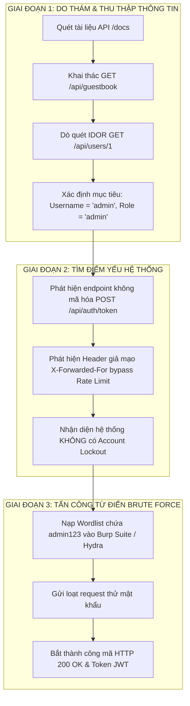

# TÀI LIỆU HƯỚNG DẪN KỸ THUẬT: ĐIỀU TRA DO THÁM, TẤN CÔNG BRUTE FORCE VÀ TRIỂN KHAI PHÒNG THỦ

> **Dành cho:** Tất cả 11 thành viên Nhóm 1 - Đề tài: *Tấn công Brute Force và Chính sách Mật khẩu*  
> **Phạm vi nghiên cứu:** Hệ thống mã nguồn web nội bộ tại thư mục `/web`  
> **Mục đích:** Hướng dẫn kỹ thuật chi tiết giúp Nhóm Kỹ thuật (quay video, demo), Nhóm Nội dung (viết báo cáo 5 chương) và Nhóm Trình bày (slide, thuyết trình) phối hợp đồng bộ và chính xác.

---

## MỤC LỤC

1. [Tổng quan Kiến trúc Hệ thống Web & Chuỗi Tấn công (Kill Chain)](#1-tong-quan-kien-truc-he-thong-web--chuoi-tan-cong-kill-chain)
2. [Chi tiết Các Lỗ hổng Do thám & Điều tra (Reconnaissance Flaws)](#2-chi-tiet-cac-lo-hong-do-tham--dieu-tra-reconnaissance-flaws)
3. [Chi tiết Các Sơ hở Hỗ trợ Tấn công Brute Force](#3-chi-tiet-cac-so-ho-ho-tro-tan-cong-brute-force)
4. [Kịch bản Demo Thực nghiệm (Dành cho Người 1, 2, 3)](#4-kich-ban-demo-thuc-nghiem-danh-cho-nguoi-1-2-3)
5. [Hướng dẫn Biên soạn Báo cáo 5 Chương (Dành cho Người 4, 5, 6, 7, 8)](#5-huong-dan-bien-soan-bao-cao-5-chuong-danh-cho-nguoi-4-5-6-7-8)
6. [Hướng dẫn Slide & Thuyết trình (Dành cho Người 9, 10, 11)](#6-huong-dan-slide--thuyet-trinh-danh-cho-nguoi-9-10-11)
7. [Mã nguồn Mẫu Triển khai Phòng thủ (Account Lockout & Hardening)](#7-ma-nguon-mau-trien-khai-phong-thu-account-lockout--hardening)

---

## 1. TỔNG QUAN KIẾN TRÚC HỆ THỐNG WEB & CHUỖI TẤN CÔNG (KILL CHAIN)

### 1.1. Kiến trúc công nghệ của Web (`/web`)
- **Frontend (`/web/frontend`):** React 18, TypeScript, Tailwind CSS, Vite. Sử dụng thư viện mã hóa client-side `node-forge` (RSA-OAEP 2048-bit + AES-GCM 256-bit).
- **Backend API (`/web/backend`):** Python FastAPI, SQLAlchemy ORM, SQLite (`guestbook.db`), thư viện băm mật khẩu `bcrypt`, xác thực bằng JSON Web Token (`PyJWT`).
- **Mạng & Triển khai:** Docker Compose kết hợp 2 proxy Tailscale.

### 1.2. Chuỗi Tấn công Mô phỏng (Attack Kill Chain)
Một cuộc tấn công Brute Force trong thực tế không bao giờ bắt đầu bằng việc "đoán mò ngẫu nhiên", mà luôn trải qua chuỗi 3 giai đoạn:



---

## 2. CHI TIẾT CÁC LỖ HỔNG DO THÁM & ĐIỀU TRA (RECONNAISSANCE FLAWS)

Trong giai đoạn này, kẻ tấn công tìm cách xác định xem hệ thống có những tài khoản nào, ai là quản trị viên và cấu trúc API ra sao.

### Lỗ hổng 2.1: Lộ Username và Role Admin qua API Guestbook công khai
- **Tập tin liên quan:** `web/backend/app/routers/guestbook.py` (Dòng 92 - 111 và 160 - 164)
- **Bản chất kỹ thuật:**
  - Endpoint `GET /api/guestbook` là API công khai, bất kỳ ai cũng có thể đọc mà không cần đăng nhập.
  - Khi một người dùng đã đăng nhập để lại bình luận, mã nguồn tự động lấy `username` thật và `role` từ cơ sở dữ liệu:
    ```python
    if current_user:
        user_id = current_user.id
        author_name = current_user.username  # Lấy username thật
    ```
  - Khi phản hồi trả về client:
    ```python
    author_role = msg.user.role if msg.user else "anonymous"
    return GuestbookResponse(
        ...,
        author_name=msg.author_name,
        author_role=author_role, # Trả về "admin" hoặc "user"
        user_id=msg.user_id
    )
    ```
- **Ý nghĩa đối với kẻ tấn công:** Chỉ cần mở trình duyệt hoặc gửi lệnh `GET /api/guestbook`, kẻ tấn công lập tức biết hệ thống có tài khoản tên là `admin` và tài khoản này nắm giữ quyền quản trị cao nhất (`role: "admin"`).

### Lỗ hổng 2.2: Dò quét toàn bộ danh sách người dùng qua IDOR (`GET /api/users/{user_id}`)
- **Tập tin liên quan:** `web/backend/app/routers/users.py` (Dòng 27 - 38)
- **Bản chất kỹ thuật:**
  - Endpoint `GET /api/users/{user_id}` không yêu cầu xác thực (`current_user = Depends(...)` bị bỏ trống).
  - Bất kỳ ai cũng có thể gửi yêu cầu với `user_id` tăng dần: `1`, `2`, `3`,...
  - Dữ liệu trả về theo schema `UserResponse` chứa đầy đủ `id`, `username`, `role`.
- **Ý nghĩa đối với kẻ tấn công:** Cho phép thu thập 100% danh sách tài khoản hiện có trong hệ thống (User Enumeration). Tài khoản `id=1` gần như luôn là tài khoản quản trị hệ thống.

### Lỗ hổng 2.3: Lộ tài liệu API Swagger công khai (`/docs` & `/api/openapi.json`)
- **Tập tin liên quan:** `web/backend/app/main.py` (Dòng 64)
- **Bản chất kỹ thuật:**
  - Hệ thống để mở `openapi_url=f"{settings.API_PREFIX}/openapi.json"` mà không tắt trong môi trường production.
  - Khi truy cập `http://localhost:7000/docs`, toàn bộ sơ đồ API, định dạng dữ liệu (JSON, Form URL Encoded), các endpoint nhạy cảm đều hiển thị trực quan.
- **Ý nghĩa đối với kẻ tấn công:** Giúp kẻ tấn công hiểu rõ mọi tham số đầu vào mà không cần đọc mã nguồn hay dịch ngược file JavaScript.

### Lỗ hổng 2.4: Tiết lộ sự tồn tại của tài khoản qua API Đăng ký (`POST /api/auth/register`)
- **Tập tin liên quan:** `web/backend/app/routers/auth.py` (Dòng 28 - 34)
- **Bản chất kỹ thuật:**
  - Khi thử đăng ký một username đã có, hệ thống trả về HTTP 400 kèm thông điệp: `"Tên đăng nhập này đã tồn tại. Vui lòng chọn tên khác."`.
- **Ý nghĩa đối với kẻ tấn công:** Kẻ tấn công có thể đưa một danh sách tên nhân viên/người dùng phổ biến vào endpoint đăng ký. Tên nào báo lỗi "đã tồn tại" chính là tài khoản có thật cần nhắm đến.

### Lỗ hổng 2.5: Phân tích chênh lệch thời gian phản hồi (Timing Attack)
- **Tập tin liên quan:** `web/backend/app/routers/auth.py` (Dòng 68 - 75)
- **Bản chất kỹ thuật:**
  ```python
  user = db.query(User).filter(User.username == payload.username).first()
  if not user or not verify_password(payload.password, user.hashed_password):
      raise HTTPException(status_code=401, detail="Tên đăng nhập hoặc mật khẩu không đúng")
  ```
  - Nếu `user` không tồn tại: Biểu thức dừng ngay tại `not user` (short-circuit), không gọi hàm băm Bcrypt $\rightarrow$ Phản hồi cực nhanh (~2 - 5 ms).
  - Nếu `user` có tồn tại nhưng sai mật khẩu: Hệ thống thực thi hàm băm `verify_password()`, tính toán băm Bcrypt tốn CPU $\rightarrow$ Phản hồi chậm hơn đáng kể (~150 - 300 ms).
- **Ý nghĩa đối với kẻ tấn công:** Đo thời gian phản hồi của request cho phép khẳng định một username có tồn tại hay không, ngay cả khi thông báo lỗi trả về là chung chung.

---

## 3. CHI TIẾT CÁC SƠ HỞ HỖ TRỢ TẤN CÔNG BRUTE FORCE

Sau khi biết được tài khoản mục tiêu là `admin`, kẻ tấn công lợi dụng tiếp các sơ hở sau để tấn công vét cạn mật khẩu:

### Sơ hở 3.1: Lỗ hổng Bypass cơ chế Giới hạn tần suất (Rate Limiting Bypass)
- **Tập tin liên quan:** `web/backend/app/rate_limit.py` (Dòng 8 - 16 và Dòng 47 - 66)
- **Bản chất kỹ thuật:**
  Backend có viết cơ chế giới hạn 5 lần thử / 15 phút, nhưng tồn tại 2 sơ hở cực lớn:
  1. **Tin tưởng Header `X-Forwarded-For` từ client:**
     ```python
     forwarded = request.headers.get("X-Forwarded-For")
     if forwarded:
         return forwarded.split(",")[0].strip()
     ```
     Hệ thống lấy IP từ header do chính client tự gửi. Kẻ tấn công chỉ cần đổi giá trị `X-Forwarded-For: 10.0.0.1`, `X-Forwarded-For: 10.0.0.2` trong mỗi request là bộ đếm số lần thử của hệ thống bị qua mặt hoàn toàn.
  2. **Tồn tại Backdoor `"testclient"`:**
     ```python
     if client_ip == "testclient":
         return  # Bỏ qua hoàn toàn rate limit!
     ```
     Chỉ cần đính kèm header `X-Forwarded-For: testclient`, rate limiter sẽ bị vô hiệu hóa 100%.

### Sơ hở 3.2: Lộ Endpoint xác thực chuẩn dạng thuần (`POST /api/auth/token`)
- **Tập tin liên quan:** `web/backend/app/routers/auth.py` (Dòng 83 - 98)
- **Bản chất kỹ thuật:**
  - Giao diện người dùng (Frontend) sử dụng cơ chế mã hóa RSA + AES (`/api/auth/login`), gây khó khăn cho việc chặn bắt gói tin thông thường.
  - Tuy nhiên, Backend lại mở thêm endpoint chuẩn OAuth2: `POST /api/auth/token`. Endpoint này nhận dữ liệu dạng `application/x-www-form-urlencoded` gồm `username` và `password` thuần (Plaintext).
- **Ý nghĩa đối với kẻ tấn công:** Không cần viết code giải mã RSA/AES phức tạp, kẻ tấn công có thể nạp thẳng endpoint `/api/auth/token` vào các công cụ như Burp Suite Intruder hoặc Hydra để dò mật khẩu trực tiếp.

### Sơ hở 3.3: Hoàn toàn không có cơ chế Khóa tài khoản (Account Lockout Policy)
- **Tập tin liên quan:** `web/backend/app/models.py` (Bảng `User`) và `web/backend/app/routers/auth.py`
- **Bản chất kỹ thuật:**
  - Trong database, bảng `User` không có các trường ghi nhận số lần đăng nhập sai (`failed_attempts`) hay thời gian khóa (`locked_until`).
  - Khi đăng nhập sai, hệ thống chỉ ghi log `logger.warning(...)` mà không hề khóa tài khoản.
- **Ý nghĩa đối với kẻ tấn công:** Kẻ tấn công có thể thử hàng triệu mật khẩu liên tục (Infinite Guessing) mà tài khoản không bao giờ bị khóa tạm thời hay vô hiệu hóa.

### Sơ hở 3.4: Chính sách mật khẩu lỏng lẻo & Mật khẩu mặc định dễ đoán
- **Tập tin liên quan:** `web/backend/app/schemas.py` (Dòng 8), `web/backend/app/main.py` (Dòng 30)
- **Bản chất kỹ thuật:**
  - Chính sách mật khẩu chỉ yêu cầu độ dài tối thiểu 6 ký tự: `password: str = Field(..., min_length=6, max_length=100)`. Không yêu cầu chữ hoa, chữ số, ký tự đặc biệt.
  - Khi khởi tạo hệ thống lần đầu, hàm `seed_default_admin()` gán mật khẩu mặc định:
    ```python
    admin_password = os.getenv("ADMIN_PASSWORD") or "admin123"
    ```
    Trong `docker-compose.yml`, biến `ADMIN_PASSWORD` không được thiết lập. Vì vậy, mật khẩu tài khoản `admin` luôn mặc định là `admin123`.
- **Ý nghĩa đối với kẻ tấn công:** `admin123` là mật khẩu nằm trong Top 10 mật khẩu phổ biến nhất thế giới. Bất kỳ bộ từ điển mật khẩu cơ bản nào (Wordlist) cũng sẽ dò ra mật khẩu này trong vòng vài giây đầu tiên.

---

## 4. KỊCH BẢN DEMO THỰC NGHIỆM (DÀNH CHO NGƯỜI 1, 2, 3)

Nhóm Kỹ thuật và Video gồm 3 thành viên sẽ tiến hành thực nghiệm theo 2 kịch bản nối tiếp nhau:

### 4.1. Kịch bản 1: Tấn công Brute Force thành công (Người 1 thao tác, Người 3 quay)
- **Mục tiêu:** Chứng minh hệ thống ban đầu bị lộ sơ hở và bị bẻ khóa thành công.
- **Các bước thực hiện:**
  1. **Bước 1 (Do thám):**
     - Mở trình duyệt truy cập `http://localhost:7000/api/guestbook` hoặc `http://localhost:7000/docs`.
     - Chỉ ra dữ liệu JSON trả về có `author_name: "admin"` và `author_role: "admin"`. Người 1 chụp ảnh màn hình bước này (chứng minh tìm thấy username mục tiêu).
  2. **Bước 2 (Chuẩn bị Wordlist):**
     - Tạo một file từ điển mật khẩu `passwords.txt` chứa khoảng 10 - 20 mật khẩu mẫu (vd: `123456`, `password`, `qwerty`, `admin`, `admin123`, `letmein`).
  3. **Bước 3 (Thực hiện Brute Force qua Burp Suite Intruder):**
     - Bắt gói tin gửi tới endpoint: `POST /api/auth/token`.
     - Trong header request, thêm: `X-Forwarded-For: testclient` (để vượt qua Rate Limit).
     - Định dạng body: `username=admin&password=§password§`.
     - Nạp file `passwords.txt` vào Payload và bấm **Start Attack**.
  4. **Bước 4 (Ghi nhận kết quả):**
     - Các mật khẩu sai sẽ trả về mã **HTTP 401 Unauthorized** (chiều dài gói tin ngắn).
     - Khi tới mật khẩu `admin123`, hệ thống trả về mã **HTTP 200 OK** kèm Token JWT.
     - Người 1 chụp ảnh bảng kết quả của Burp Suite cho thấy dòng chứa `admin123` có HTTP Status 200.

---

### 4.2. Kịch bản 2: Thiết lập Phòng thủ & Chặn đứng Tấn công (Người 2 thao tác, Người 3 quay)
- **Mục tiêu:** Thiết lập cơ chế Account Lockout (khóa sau 5 lần sai), vá lỗi Rate Limit và chứng minh công cụ tấn công bị chặn hoàn toàn.
- **Các bước thực hiện:**
  1. **Bước 1 (Áp dụng bản vá phòng thủ):**
     - Người 2 cập nhật mã nguồn theo [Mục 7](#7-ma-nguon-mau-trien-khai-phong-thu-account-lockout--hardening) bên dưới (kích hoạt đếm số lần sai và khóa tài khoản 15 phút nếu sai $\ge 5$ lần).
     - Loại bỏ backdoor `testclient` và sửa cơ chế lấy IP.
  2. **Bước 2 (Chạy lại công cụ tấn công):**
     - Người 1 chạy lại đợt tấn công từ điển với cùng file `passwords.txt`.
  3. **Bước 3 (Ghi nhận kết quả phòng thủ):**
     - Từ lần thử thứ 1 đến 4: Trả về **HTTP 401**.
     - Từ lần thử thứ 5 trở đi: Hệ thống trả về **HTTP 403 Forbidden** hoặc **HTTP 429 Too Many Requests** với thông báo `"Tài khoản đã bị tạm khóa 15 phút do nhập sai quá 5 lần"`.
     - Dù trong từ điển có mật khẩu đúng `admin123` nằm ở vị trí thứ 6 trở đi, công cụ vẫn **không thể đăng nhập được** vì tài khoản đã bị khóa.
     - Người 2 chụp ảnh màn hình thông báo lỗi 403/429 này để đưa vào Báo cáo Chương 4.

---

## 5. HƯỚNG DẪN BIÊN SOẠN BÁO CÁO 5 CHƯƠNG (DÀNH CHO NGƯỜI 4, 5, 6, 7, 8)

Các thành viên viết báo cáo sử dụng các phát hiện kỹ thuật trên để đưa vào đúng các đề mục quy định trong `README.md`:

### 5.1. Người 4 phụ trách Mở đầu & Chương 1: Cơ sở lý thuyết về Brute Force
- **Phần Mở đầu:**
  - Nhấn mạnh: Xác thực mật khẩu là phòng tuyến đầu tiên bảo vệ tài nguyên người dùng.
  - Nêu rõ phạm vi: Thử nghiệm trên mô hình web nội bộ, phục vụ nghiên cứu học tập, tuân thủ đạo đức an toàn thông tin.
- **Mục 1.1 (Cơ chế xác thực):** Trình bày luồng xác thực Client - Server, vai trò của hàm băm một chiều (Bcrypt) và lưu trữ Token JWT.
- **Mục 1.2 & 1.3 (Brute Force & Dictionary Attack):**
  - Định nghĩa Brute Force thuần túy ($O(C^N)$ không gian mẫu lớn) so với Tấn công Từ điển (Dictionary Attack - sử dụng danh sách mật khẩu có sẵn để tối ưu thời gian).
- **Mục 1.4 (Công cụ phổ biến):** Giới thiệu nguyên lý hoạt động của Burp Suite Intruder (chế độ Sniper payload) và cURL / Python automation script.

### 5.2. Người 5 phụ trách Chương 2: Chính sách Mật khẩu và Phòng thủ
- **Mục 2.1 & 2.2 (Chính sách & Tiêu chuẩn mật khẩu mạnh):**
  - Phân tích vì sao quy định 6 ký tự hiện tại của web là điểm yếu chí mạng.
  - Đề xuất tiêu chuẩn NIST: Độ dài tối thiểu $\ge 8$ - 12 ký tự, bắt buộc tổ hợp 3/4 nhóm ký tự (hoa, thường, số, ký tự đặc biệt), chống từ điển phổ biến.
- **Mục 2.3 (Cơ chế Account Lockout):**
  - Giải thích thuật toán: Lưu `failed_attempts` và mốc thời gian `locked_until`. Khi số lần vi phạm chạm ngưỡng (ngưỡng 5 lần), vô hiệu hóa xác thực trong khoảng thời gian nhất định (15 phút).
  - Phân tích ưu/nhược điểm: Chống Brute Force hiệu quả nhưng cần lưu ý tránh nguy cơ bị lợi dụng gây Từ chối dịch vụ tài khoản (Account Denial of Service).
- **Mục 2.4 (Cơ chế bổ sung):** Trình bày về Rate Limiting (Token Bucket / Leaky Bucket) và giải pháp CAPTCHA (Cloudflare Turnstile / reCAPTCHA).

### 5.3. Người 6 phụ trách Chương 3: Triển khai Kịch bản Tấn công
*(Lấy hình ảnh do Người 1 chụp và Người 3 quay clip)*
- **Mục 3.1 (Môi trường thử nghiệm):** Mô tả hệ thống nạn nhân chạy trên `localhost:7000`, sử dụng API endpoint `/api/auth/token`.
- **Mục 3.2 (Chuẩn bị Wordlist):** Liệt kê bảng mật khẩu mẫu trong file từ điển `passwords.txt`.
- **Mục 3.3 (Các bước tiến hành):**
  - Bước do thám: Tìm username `admin` qua API Guestbook và Swagger `/docs`.
  - Bước tấn công: Cấu hình Burp Suite Intruder, chèn header bypass `X-Forwarded-For: testclient`.
- **Mục 3.4 (Kết quả Kịch bản 1):** Chèn hình ảnh Burp Suite bắt được mã **HTTP 200 OK** tại mật khẩu `admin123`.

### 5.4. Người 7 phụ trách Chương 4: Triển khai Phòng thủ và Phân tích
*(Lấy hình ảnh do Người 2 chụp)*
- **Mục 4.1 (Thiết lập phòng thủ):**
  - Trình bày giải pháp code: Thêm logic khóa tài khoản sau 5 lần sai vào backend, sửa hàm lọc IP.
- **Mục 4.2 (Kịch bản tấn công lại):** Mô tả lại việc dùng Burp Suite chạy lại từ điển cũ vào hệ thống đã vá.
- **Mục 4.3 (Phân tích kết quả):**
  - Hiện tượng: Hệ thống trả về mã **HTTP 403 / 429**, hiển thị thông báo tài khoản bị khóa.
  - Tốc độ và hiệu quả của tool: Bị triệt tiêu hoàn toàn sau lần thử thứ 5; dù trong từ điển có mật khẩu đúng thì kẻ tấn công vẫn không thể chiếm quyền tài khoản.

### 5.5. Người 8 phụ trách Chương 5: Kết luận
- **Mục 5.1 (Kết quả đạt được):** Nhóm đã mô phỏng thành công quá trình từ do thám đến tấn công Brute Force, đồng thời xây dựng thành công giải pháp phòng thủ Account Lockout và Password Policy.
- **Mục 5.2 (Hạn chế đề tài):** Thử nghiệm quy mô cục bộ (Localhost), chưa kiểm thử tấn công phân tán (Distributed Brute Force qua botnet/proxy xoay).
- **Mục 5.3 (Hướng phát triển):** Tích hợp xác thực 2 bước (2FA / OTP TOTP), sinh trắc học (WebAuthn/FIDO2) để loại bỏ hoàn toàn nguy cơ từ mật khẩu truyền thống.

---

## 6. HƯỚNG DẪN SLIDE & THUYẾT TRÌNH (DÀNH CHO NGƯỜI 9, 10, 11)

- **Người 9 (Tổng biên tập / Format Word):**
  - Thu nhận file Word từ Người 4, 5, 6, 7, 8 theo đường dẫn `docs/drafts/`.
  - Đồng bộ font chữ (Times New Roman, cỡ 13 hoặc 14 theo mẫu trường ĐH Công Thương TP.HCM), định dạng lề (trên 2.0cm, dưới 2.0cm, trái 3.0cm, phải 2.0cm), đánh số trang tự động và tạo Mục lục tự động.
  - Xuất bản file hoàn chỉnh vào thư mục `FINAL_DELIVERY/`.
- **Người 10 (Thiết kế Slide PowerPoint):**
  - Bố cục Slide 10 - 15 trang:
    1. Giới thiệu đề tài & thành viên nhóm.
    2. Sơ đồ chuỗi tấn công (Do thám $\rightarrow$ Brute Force $\rightarrow$ Khai thác).
    3. Trình diễn các điểm yếu mã nguồn (Code snippet).
    4. Slide so sánh trực quan Kết quả: Trước phòng thủ (HTTP 200) vs Sau phòng thủ (HTTP 403).
    5. Kết luận & Khuyến nghị chính sách mật khẩu.
- **Người 11 (Thuyết trình & Khớp kịch bản Video):**
  - Thời lượng thuyết trình: Khoảng 7 - 10 phút.
  - Phối hợp với video demo của Người 3: Khi video chiếu tới đoạn bắt gói tin trong Burp Suite, Người 11 phải giải thích rõ ràng mã phản hồi và nguyên lý phòng thủ Account Lockout đã chặn đứng cuộc tấn công ra sao.

---

## 7. MÃ NGUỒN MẪU TRIỂN KHAI PHÒNG THỦ (ACCOUNT LOCKOUT & HARDENING)

Dưới đây là mã nguồn kỹ thuật mẫu dành cho **Người 2** áp dụng vào thư mục `web/backend` để hiện thực hóa Chương 4:

### 7.1. Cập nhật Model User trong `web/backend/app/models.py`
Thêm 2 trường quản lý số lần thử sai và thời gian khóa:
```python
from datetime import datetime
from sqlalchemy import Column, Integer, String, DateTime, Boolean

class User(Base):
    __tablename__ = "users"

    id = Column(Integer, primary_key=True, index=True)
    username = Column(String(50), unique=True, index=True, nullable=False)
    hashed_password = Column(String(255), nullable=False)
    role = Column(String(20), default="user", nullable=False)

    # BỔ SUNG CƠ CHẾ PHÒNG THỦ BRUTE FORCE:
    failed_login_attempts = Column(Integer, default=0, nullable=False)
    locked_until = Column(DateTime, nullable=True)

    # ... các trường profile khác giữ nguyên ...
```

### 7.2. Cập nhật Logic Xác thực trong `web/backend/app/routers/auth.py`
Kiểm tra trạng thái khóa tài khoản và đếm số lần sai trong cả 2 endpoint `/login` và `/token`:
```python
from datetime import datetime, timedelta

MAX_FAILED_ATTEMPTS = 5       # Cho phép sai tối đa 5 lần
LOCKOUT_DURATION_MINUTES = 15 # Khóa tài khoản trong 15 phút

@router.post("/token", response_model=AuthResponse)
def login_for_access_token(
    response: Response,
    form_data: OAuth2PasswordRequestForm = Depends(),
    db: Session = Depends(get_db)
):
    user = db.query(User).filter(User.username == form_data.username).first()
    
    # 1. Kiểm tra tài khoản có đang bị khóa hay không
    now = datetime.utcnow()
    if user and user.locked_until:
        if now < user.locked_until:
            remaining_seconds = int((user.locked_until - now).total_seconds())
            remaining_minutes = max(1, remaining_seconds // 60)
            raise HTTPException(
                status_code=status.HTTP_403_FORBIDDEN,
                detail=f"Tài khoản đang bị tạm khóa do nhập sai quá nhiều lần. Vui lòng thử lại sau {remaining_minutes} phút."
            )
        else:
            # Hết thời gian khóa -> Reset lại bộ đếm
            user.locked_until = None
            user.failed_login_attempts = 0
            db.commit()

    # 2. Kiểm tra mật khẩu
    if not user or not verify_password(form_data.password, user.hashed_password):
        if user:
            user.failed_login_attempts += 1
            if user.failed_login_attempts >= MAX_FAILED_ATTEMPTS:
                user.locked_until = now + timedelta(minutes=LOCKOUT_DURATION_MINUTES)
                db.commit()
                logger.warning(f"Security Alert: Tài khoản '{user.username}' đã bị khóa do nhập sai {MAX_FAILED_ATTEMPTS} lần.")
                raise HTTPException(
                    status_code=status.HTTP_403_FORBIDDEN,
                    detail=f"Tài khoản đã bị tạm khóa {LOCKOUT_DURATION_MINUTES} phút do nhập sai quá {MAX_FAILED_ATTEMPTS} lần liên tiếp."
                )
            db.commit()
            
        raise HTTPException(
            status_code=status.HTTP_401_UNAUTHORIZED,
            detail="Tên đăng nhập hoặc mật khẩu không đúng",
            headers={"WWW-Authenticate": "Bearer"},
        )

    # 3. Đăng nhập thành công -> Reset bộ đếm số lần sai về 0
    user.failed_login_attempts = 0
    user.locked_until = None
    db.commit()

    token = create_access_token(data={"sub": user.username, "role": user.role, "user_id": user.id})
    response.set_cookie(key="access_token", value=token, httponly=True, secure=True, samesite="strict")
    return AuthResponse(user=UserResponse.model_validate(user))
```

### 7.3. Vá lỗ hổng Rate Limiter trong `web/backend/app/rate_limit.py`
Xóa bỏ backdoor `"testclient"` và bảo vệ header `X-Forwarded-For`:
```python
def get_client_ip(request: Request) -> str:
    """
    Lấy IP an toàn từ kết nối socket trực tiếp của client
    Không tin cậy mù quáng header X-Forwarded-For nếu không đi qua reverse proxy tin cậy.
    """
    return request.client.host if request.client else "unknown_ip"

def auth_rate_limiter(request: Request):
    client_ip = get_client_ip(request)
    now = time.time()
    
    # Dọn dẹp các mốc cũ hơn 15 phút (900s)
    _auth_rate_limit_store[client_ip] = [ts for ts in _auth_rate_limit_store[client_ip] if now - ts < 900]
    
    if len(_auth_rate_limit_store[client_ip]) >= 10:
        raise HTTPException(
            status_code=status.HTTP_429_TOO_MANY_REQUESTS,
            detail="Quá nhiều yêu cầu xác thực từ IP này. Vui lòng chờ 15 phút."
        )
    
    _auth_rate_limit_store[client_ip].append(now)
```

---

## 8. TỔNG KẾT & DANH MỤC KIỂM TRA (CHECKLIST CHO NHÓM)

| Thành viên | Nhiệm vụ chính | Trạng thái cần đạt |
| :--- | :--- | :--- |
| **Người 1** | Thực hiện kịch bản tấn công (Do thám + Burp Suite Intruder) | Có ảnh chụp Burp Suite trả về HTTP 200 OK |
| **Người 2** | Áp dụng bản vá Account Lockout & kiểm thử phòng thủ | Có ảnh chụp hệ thống báo lỗi HTTP 403 khi sai 5 lần |
| **Người 3** | Quay video màn hình và cắt ghép clip | Video hoàn chỉnh $\le 10$ phút |
| **Người 4** | Soạn thảo Mở đầu & Chương 1 (Lý thuyết) | File Word `Chuong1.docx` trong `docs/drafts/` |
| **Người 5** | Soạn thảo Chương 2 (Chính sách mật khẩu & Lockout) | File Word `Chuong2.docx` trong `docs/drafts/` |
| **Người 6** | Soạn thảo Chương 3 (Triển khai tấn công) | File Word `Chuong3.docx` gắn đủ ảnh của Người 1 |
| **Người 7** | Soạn thảo Chương 4 (Triển khai phòng thủ) | File Word `Chuong4.docx` gắn đủ ảnh của Người 2 |
| **Người 8** | Soạn thảo Chương 5 (Kết luận & Hướng phát triển) | File Word `Chuong5.docx` trong `docs/drafts/` |
| **Người 9** | Gom 5 chương, format chuẩn mẫu Đại học Công Thương | File Word hoàn chỉnh tại `FINAL_DELIVERY/` |
| **Người 10** | Thiết kế slide PowerPoint thuyết trình | File `.pptx` tại `presentations/` |
| **Người 11** | Thuyết trình và khớp kịch bản với Video | Khớp tiến độ nói với video dưới 10 phút |
